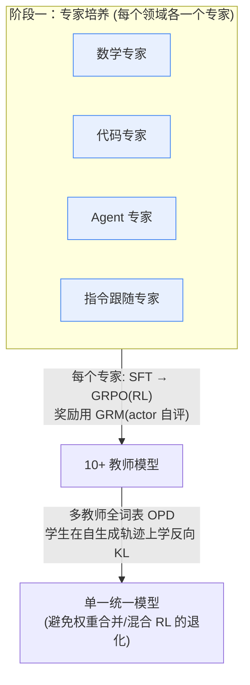

# DeepSeek-V4：面向百万 Token 上下文的高效架构

> 一句话：DeepSeek-V4 通过**混合注意力（CSA + HCA）**、**流形约束超连接（mHC）** 和 **Muon 优化器**，把百万 Token 上下文的推理成本压到 V3.2 的一小部分，让超长上下文成为常规能力。

## 核心论点

长上下文和推理时扩展（test-time scaling）的根本瓶颈是原始注意力机制的**二次复杂度**。DeepSeek-V4 通过架构创新击穿这道效率墙：在 1M Token 上下文下，即使是更大的 V4-Pro 也只需 **27% 的单 Token 推理 FLOPs** 和 **10% 的 KV 缓存**（相对 V3.2）；更小的 V4-Flash 进一步压到 **10% FLOPs、7% KV 缓存**。

这是**预览版**（preview），作者明确说架构为了压低风险保留了很多已验证组件，因此偏复杂，未来会做精简。

## 模型阵容

| 模型 | 总参数 | 激活参数 | 上下文 |
|------|--------|----------|--------|
| DeepSeek-V4-Pro | 1.6T | 49B | 1M tokens |
| DeepSeek-V4-Flash | 284B | 13B | 1M tokens |

- 两者都是 MoE（DeepSeekMoE 架构），原生支持 1M 上下文。
- **-Max** 是最大推理努力模式（如 V4-Pro-Max）。三档推理努力：Non-think / Think High / Think Max。
- 预训练量：Flash 32T tokens，Pro 33T tokens。
- 检查点开源在 HuggingFace（deepseek-ai/deepseek-v4）。

## 三大架构创新

一个 V4 Transformer 块的整体数据流（论文 Figure 2）——注意力子层用 CSA / HCA，前馈用 DeepSeekMoE，残差用 mHC（图中 Pre-/Post-Block Mixing + Residual Mixing），顶部并接 MTP 头：

![[deepseek-v4-overall-arch.png]]

> 优化器：除 embedding、预测头、mHC 静态偏置/门控、RMSNorm 权重外，其余权重用 **Muon** 更新；训练时并接 **MTP 头**做多 Token 预测（推理可丢）。

### 1. 混合注意力：CSA + HCA（交错排布）

超长上下文下注意力是主要计算瓶颈。V4 设计了两种压缩注意力并交错使用：

- **CSA（Compressed Sparse Attention，压缩稀疏注意力）**：先把每 *L* 个 Token 的 KV 压成 1 个条目（压缩序列长度到 1/L），再用 **DeepSeek Sparse Attention (DSA)** 通过 **Lightning Indexer** 选 top-k 压缩条目做核心注意力。用 **Shared KV MQA**（多查询注意力）。
- **HCA（Heavily Compressed Attention，重压缩注意力）**：更激进地把每 *L'*（*L' > L*）个 Token 压成 1 条，但保持**稠密**注意力（不做稀疏选择）。
- 两者都用 **Grouped Output Projection**（分组输出投影）降低大 head 数带来的投影开销。

**辅助技巧**：
- Query / KV 条目 RMSNorm（防注意力 logit 爆炸）
- 部分 RoPE（只作用在每个向量最后 64 维；输出侧用位置 −*t* 补偿，保留相对位置信息）
- **滑动窗口注意力**分支（补充局部细粒度依赖，因压缩块内 Token 互相不可见）
- **Attention Sink**（可学习 sink logit，允许注意力总和不为 1，甚至接近 0）

**效率结果**：以 BF16 GQA8（head dim 128）为基线，1M 上下文下 V4 的 KV 缓存约为基线的 **2%**。

**图解——两条压缩注意力的核心结构（论文 Figure 3 / Figure 4）：**

**CSA**：Token-Level Compressor 把每 *m* 个 KV 压成 1 条 → Lightning Indexer（自己也有一路压缩 + Multi-Query Attention）打分选 top-k → 与滑动窗口 KV 拼接 → Shared-KV MQA：![[Pasted image 20260824090812.png]]

![[deepseek-v4-csa.png]]

**HCA**：结构类似但压得更狠（*m′ ≫ m*），且**不做 top-k 稀疏选择**（无 Lightning Indexer 分支），压完直接稠密注意力：![[Pasted image 20260824090757.png]]

![[deepseek-v4-hca.png]]

**关键公式：**

- **压缩**：把每 $L$ 个 Token 的 KV 聚成一条，序列长度 $T \to T/L$
$$\mathbf{c}_j = \mathrm{Compress}\big(\mathbf{kv}_{(j-1)L+1},\ \dots,\ \mathbf{kv}_{jL}\big)$$

- **稀疏选择（CSA）**：Lightning Indexer 打分后取 top-$k$ 个压缩条目做注意力
$$\mathcal{S}_t = \operatorname*{top\text{-}k}_{j}\ I(\mathbf{q}_t,\mathbf{c}_j),\qquad \mathbf{o}_t = \sum_{j\in\mathcal{S}_t}\mathrm{softmax}\big(\mathbf{q}_t^\top \mathbf{c}_j\big)\,\mathbf{v}_j$$

- **Attention Sink**：分母加一个可学习的 sink 项 $s_0$，允许注意力权重之和 $<1$（甚至趋近 0）
$$a_i = \frac{e^{s_i}}{e^{s_0} + \sum_{j} e^{s_j}}$$

### 2. mHC：流形约束超连接（Manifold-Constrained Hyper-Connections）

强化相邻 Transformer 块之间的残差连接，替代传统残差。

> 📄 mHC 建立在 **Hyper-Connections（HC）** 之上——HC（ByteDance, ICLR 2025）用可学习的深度/宽度连接替代残差；mHC 在其残差映射上加**双随机矩阵流形约束**换取深层数值稳定。原理与图解详见 [Hyper-Connections 超连接](Hyper-Connections%20超连接.md)。

- 标准超连接（HC）把残差流宽度扩展 *hc* 倍，提供独立于隐藏维度的扩展轴，但**堆叠多层时数值不稳定**。
- mHC 的核心：把残差映射矩阵约束到**双随机矩阵流形**（Birkhoff 多面体），保证谱范数 ≤ 1（映射非扩张），提升前向和反向的数值稳定性。该集合对乘法封闭，深层堆叠也稳。
- 用 **Sinkhorn-Knopp 算法**（max=20 次迭代）投影到双随机矩阵；输入/输出映射用 Sigmoid 约束非负有界。
- 参数动态生成（输入相关 + 输入无关分量）。
- 工程上把 mHC 墙钟开销控制在重叠后 1F1B 流水线阶段的 **6.7%**（融合核 + 重计算 + 调整 DualPipe）。

三代残差连接的演进对比——(a) 标准残差：单条残差流直连；(b) HC：残差流宽度扩展 *n* 倍，深度/宽度连接均可学习；(c) mHC：在 HC 基础上把混合矩阵约束到双随机矩阵流形：

![[deepseek-v4-mhc.png]]

**核心约束——双随机矩阵（Birkhoff 多面体）：** 残差映射矩阵 $\mathbf{M}$ 被约束为非负、且行和、列和都为 1 的双随机矩阵，从而谱范数 $\|\mathbf{M}\|_2 \le 1$（映射非扩张，深层堆叠不放大数值）：

$$\mathbf{M}\in\mathcal{B}=\Big\{\,\mathbf{M}\in\mathbb{R}^{n\times n}\ \big|\ M_{ij}\ge 0,\ \textstyle\sum_i M_{ij}=1,\ \sum_j M_{ij}=1\,\Big\}$$

用 **Sinkhorn-Knopp** 迭代（≤20 次）把任意打分矩阵投影到该流形——交替做行归一化与列归一化：

$$\mathbf{M}^{(0)}=\exp(\mathbf{A}),\qquad \mathbf{M}^{(k+1)}=\mathrm{ColNorm}\big(\mathrm{RowNorm}(\mathbf{M}^{(k)})\big)$$

### 3. Muon 优化器

大部分模块用 **Muon**（更快收敛、更稳），少数模块（embedding、预测头、mHC 静态偏置/门控、所有 RMSNorm 权重）仍用 AdamW。

- **Hybrid Newton-Schulz 迭代**做正交化：10 次迭代分两段——前 8 步用激进系数快速收敛，后 2 步用温和系数把奇异值精确稳定在 1。
- 因为注意力上直接用了 RMSNorm，**不需要 QK-Clip** 技术。

**Newton-Schulz 正交化（五次迭代）：** Muon 先把动量矩阵 $\mathbf{M}$ 近似正交化，再拿它更新权重。设 $\mathbf{M}=\mathbf{U}\Sigma\mathbf{V}^\top$，迭代把所有奇异值都推向 1，收敛到 $\approx\mathbf{U}\mathbf{V}^\top$：

$$\mathbf{X}_0=\mathbf{M}/\|\mathbf{M}\|_F,\qquad \mathbf{X}_{k+1}=a\,\mathbf{X}_k+b\,\mathbf{X}_k\mathbf{X}_k^\top\mathbf{X}_k+c\,(\mathbf{X}_k\mathbf{X}_k^\top)^2\mathbf{X}_k$$

$$\mathbf{W}\ \leftarrow\ \mathbf{W}-\eta\,\mathrm{NS}(\mathbf{M})$$

**Hybrid** = 10 次迭代分两段：前 8 步用激进系数 $(a,b,c)$ 快速把奇异值拉近 1，后 2 步换温和系数精确稳定到 1（避免在 1 附近震荡/过冲）。

### 其他继承 / 微调

- 保留 DeepSeekMoE 和 **MTP（多 Token 预测）**（配置与 V3 相同）。
- MoE 亲和度打分函数从 Sigmoid 改为 **Sqrt(Softplus(·))**。
- 无辅助损失负载均衡 + 轻量序列级均衡损失。
- 前几个 Transformer 块的稠密 FFN 换成 **Hash 路由**的 MoE 层。

## 基础设施亮点

- **细粒度 EP 通信-计算重叠**：把 MoE 层拆成波（wave），单融合核流水线化 Dispatch/Combine 与 Linear-1/2，理论加速 1.92×，实测 1.50–1.73×（RL rollout 达 1.96×）。开源为 **MegaMoE**（DeepGEMM 组件）。给硬件厂商的建议：算力/带宽比比单纯带宽更关键（V4-Pro 约 6144 FLOPs/Byte）。
- **TileLang** DSL 开发融合核：Host Codegen 把每次调用的 CPU 校验开销从几十/几百微秒降到 <1μs；集成 Z3 SMT 求解器做整数分析；默认关闭 fast-math 保证精度和位级可复现。
- **批不变（batch-invariant）+ 确定性核库**：保证任意 Token 输出与其在 batch 中的位置无关、位级一致。注意力用双核策略、矩阵乘用 DeepGEMM 替代 cuBLAS、反向传播避免 atomicAdd 的非确定性。
- **KV 缓存混合精度存储**：RoPE 维度用 BF16，其余用 FP8，KV 缓存近乎减半。索引器计算用 FP4。
- 训练框架：Muon 的混合 ZeRO 分桶（padding <10% 内存开销）、两阶段上下文并行处理压缩注意力、张量级 checkpointing。
- 推理框架：异构 KV 缓存结构 + **在盘（on-disk）KV 缓存存储**，支持共享前缀复用。

## 训练

### 预训练稳定性（两个经验技巧，机理尚不完全清楚）

Loss spike 一致地与 MoE 层的异常值（outlier）相关，路由机制会加剧。两个有效手段：

- **Anticipatory Routing（预判路由）**：解耦骨干网络和路由网络的同步更新——第 *t* 步用当前参数算特征，但路由索引用历史参数 *t−τ* 计算并缓存。仅在检测到 loss spike 时触发短回滚 + 启用，额外墙钟开销可忽略。
- **SwiGLU Clamping**：把 SwiGLU 线性分量钳到 [−10, 10]，门控分量上限 10，有效消除异常值。

### 后训练（关键方法替换）

**用 On-Policy Distillation (OPD) 完全替代了混合 RL 阶段。**

两阶段范式：

1. **专家培养（Specialist Training）**：每个领域（数学、代码、Agent、指令跟随等）单独训练专家——先 SFT，再用 **GRPO** 做 RL。
   - **生成式奖励模型（GRM）**：抛弃传统标量奖励模型，用 rubric 引导数据，让 actor 网络本身充当 GRM，联合优化"评判"和"生成"能力，只需少量人工标注。
   - **新工具调用 schema**：用 `|DSML|` 特殊 token + XML 格式，减少转义失败和工具调用错误。
   - **交错思考（Interleaved Thinking）**：工具调用场景下**完整保留**全程推理轨迹（跨用户消息边界，V3.2 会丢弃）；普通对话仍在新用户消息到来时丢弃。
   - **Quick Instruction**：用专用特殊 token（`<|action|>`、`<|query|>`、`<|title|>` 等）复用已算好的 KV 缓存做辅助任务（判断是否搜索、意图识别等），省去单独小模型的冗余预填充，降低 TTFT。
2. **模型合并**：用**多教师全词表 OPD**（>10 个教师模型），学生在自己生成的轨迹上学习反向 KL，把各专家能力融进单一统一模型，避免权重合并/混合 RL 的性能退化。

**后训练基础设施**：
- **FP4（MXFP4）量化感知训练（QAT）**：作用于 MoE 专家权重和 CSA 索引器的 QK 路径；FP4→FP8 反量化无损（复用现有 FP8 训练框架）；top-k 选择器 2× 加速且保持 99.7% KV 召回。
- 全词表 OPD 的教师调度：只缓存最后一层教师隐状态，训练时重构 logits；按教师 index 排序样本，保证每个教师头每 mini-batch 只加载一次。
- **可抢占容错 rollout 服务**：Token 粒度 WAL（预写日志），抢占/故障后从持久化 token 重建 KV 缓存。从头重生成会引入**长度偏差**（短回复更易存活），故用 WAL 更正确也更高效。
- **DSec（DeepSeek Elastic Compute）沙盒**：Rust 三组件，单集群管理数十万并发沙盒实例，四种执行基座（Function Call / Container / microVM / fullVM）统一接口。

## 评测亮点

**基座模型**（Table 1）：V4-Flash-Base 用更少参数就在多数基准上超过 V3.2-Base；V4-Pro-Base 成为 DeepSeek 系列最强基座，知识类基准提升尤其显著（如 SuperGPQA 28.3→55.2、TriviaQA 27.1→62.6）。

**V4-Pro-Max（对比闭源/开源前沿）**：
- **知识**：开源模型新 SOTA。SimpleQA-Verified 领先所有开源基线约 20 个百分点，但仍落后 Gemini-3.1-Pro。
- **推理**：超越所有先前开源模型，多项指标追平 SOTA 闭源。代码竞赛与 GPT-5.4 相当（**首次开源模型在此追平闭源**），Codeforces 评分 3206，在人类选手中排第 23。
- **形式化数学**：Agentic 设置下 SOTA；Putnam-2025 混合形式-非形式推理达 **120/120 满分**。
- **Agent**：与 K2.6、GLM-5.1 相当，仍落后闭源前沿。MCPAtlas / Toolathlon 表现好，说明泛化性强（不只在内部框架好用）。内部 R&D 编码基准上超过 Claude Sonnet 4.5，接近 Opus 4.5。
- **1M 上下文**：MRCR 上超过 Gemini-3.1-Pro（但落后 Claude Opus 4.6），CorpusQA 上超过 Gemini-3.1-Pro。128K 内检索几乎无损，1M 处仍强。

**Flash vs Pro**：Flash 因参数少在知识类明显弱；但给足思考预算时推理任务可比肩；Agent 上部分基准追平 Pro，高难度任务仍落后。

**真实任务**：中文写作对 Gemini-3.1-Pro 功能写作胜率 62.7%、创意写作质量胜率 77.5%（但最难的多轮/高约束场景 Claude Opus 4.5 仍占优）；中文白领任务对 Opus-4.6-Max 非负率 63%。

## 局限与未来方向

- 架构为压低风险保留了大量组件，**偏复杂**，未来要精简到最本质设计。
- Anticipatory Routing 和 SwiGLU Clamping 的**底层原理尚不清楚**，需研究训练稳定性的基础问题。
- 探索新维度的稀疏性（如更稀疏的 embedding 模块）、低延迟架构、长程多轮 Agent、**多模态能力**、更好的数据合成策略。

## See Also

- [DeepSeek-V3 架构与低成本高效训练](DeepSeek-V3%20架构与低成本高效训练.md) — 上一代：MLA 低秩注意力 + DeepSeekMoE + 无辅助损失负载均衡 + MTP，用 FP8/DualPipe 把 671B 模型训练成本压到 $5.576M。V4 直接继承其 DeepSeekMoE 与 MTP，并把注意力、残差、优化器、后训练全面升级。
- [DeepSeek-V4 config.json 逐项详解与显存估算](DeepSeek-V4%20config.json%20逐项详解与显存估算.md) — 本文机制的**数值落地**：Pro/Flash 两份 config 逐字段解读 + 参数量/KV cache/部署卡数三笔账（含「KV ≈ 基线 2%」的手算验证）。

## Sources

- [DeepSeek-V4: Towards Highly Efficient Million-Token Context Intelligence](../../raw/deepseek/deepseek%20v4.pdf)（DeepSeek-AI, arXiv:2606.19348v1, 2026-04-26，preview 版）
