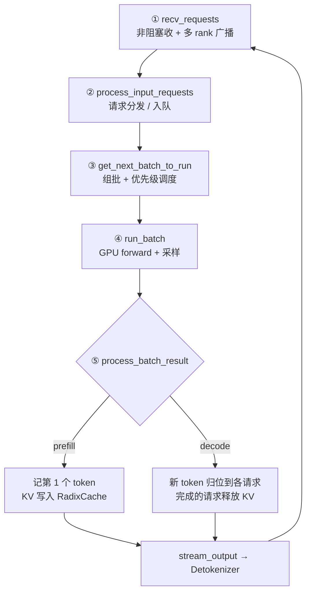
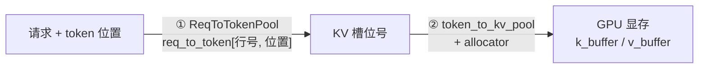

# SGLang 架构与调度循环源码走读

> 一句话：SGLang 推理引擎用**三进程分工**（Tokenizer / Scheduler / Detokenizer）+ **三层设计**（服务层 / 调度层 / 模型层）把 CPU 与 GPU 的活儿拆开；真正的引擎心跳是 Scheduler 进程里那个 `while True` 事件循环——**收请求 → 分发 → 组批 → 跑模型 → 处理结果**，循环不息。

## 一、分层架构

| 层 | 职责 | 关键组件 |
|---|---|---|
| **服务层** | 对外 HTTP / OpenAI 兼容 API，收请求、tokenize、返回响应 | HTTP Server + TokenizerManager |
| **调度层** | 引擎大脑：请求排队、连续组批（continuous batching）、KV 缓存管理、驱动前向 | Scheduler |
| **模型层** | 在 GPU 上实际跑前向（prefill / decode） | ModelWorker → ModelRunner |

架构图（引自 Awesome-ML-SYS-Tutorial 的 SGLang code-walk-through）：


## 二、三进程模型

SGLang 把流水线拆成**三个进程**，用 **ZMQ** 消息通道通信。这样 CPU 侧（tokenize / detokenize）和 GPU 侧（模型前向）能并行，不被 Python GIL 互相拖累：

| 进程 | 职责 |
|---|---|
| **主进程** | HTTP 服务 + **TokenizerManager**：把文本 tokenize 成 `input_ids` |
| **Scheduler 子进程** | **调度大脑**：组批、管 KV 缓存、驱动模型前向 |
| **Detokenizer 子进程** | 把输出 token 解码回文本，**流式**回传（增量解码细节见 §九） |


## 三、Scheduler 事件循环（核心）

进程入口 `run_scheduler_process` 启动 Scheduler 后调用 `run_event_loop`，有两种模式：

- **`event_loop_normal`**：串行——收 → 分发 → 组批 → 跑 → 处理结果，一步接一步，简单易读。
- **`event_loop_overlap`**：重叠——上一批还在 GPU 上跑时，CPU 已经在准备下一批，把调度开销藏进计算里，吞吐更高（生产常用）。

下面以 `event_loop_normal` 为例，主循环 `while True` 的五步：



### ① `recv_requests` —— 收
从两个 ZMQ 通道（用户请求 + RPC 控制）**非阻塞**地一次性拉走当前所有能读到的消息；多 GPU（TP/DP）下把请求**广播到各 rank**，解包成请求列表返回。

### ② `process_input_requests` —— 分发
遍历上一步的请求，分门别类处理；最常见的是生成请求，交给 `handle_generate_request` 入等待队列。

### ③ `get_next_batch_to_run` —— 组批（排班总入口）
每轮循环调用一次，决定「下一步 GPU 要跑什么」。

- **输入**：运行中队列 `running_batch`（老客人池）+ 上轮成品 `last_batch`
- **输出**：这一轮要跑的 `batch_to_run` + 更新后的 `last_batch`
- **prefill 优先**：先看有没有新请求要 prefill，经 `get_new_batch_prefill` → `get_new_batch_prefill_raw` 组出 prefill 批；没有才继续跑 decode。

**等待队列的优先级调度策略**（决定谁先被 prefill）：

| 策略 | 含义 |
|---|---|
| **FCFS** | 先来先服务（默认） |
| **LPM** | 最长前缀命中优先——最大化 RadixCache 复用 |
| **DFS-Weights** | 按 radix tree 深度优先加权遍历排序 |
| **LOF** | 声明输出最长优先，按请求的 `max_new_tokens` 从大到小 |
| **Random** | 随机 |
| **Routing-Key** | 按路由键亲和性排序 |

### ④ `run_batch` —— 跑批（GPU forward + 采样）
把这一轮的 `ScheduleBatch` 交给 **ModelWorker → ModelRunner**，在 GPU 上跑一次 forward 并采样。核心三步：

1. **`resolve_forward_inputs`** —— 把上轮的 **future 引用**换成真实 tensor
2. **`forward_batch_generation`** —— 真正跑 GPU forward + 采样
   调用链：`TpModelWorker.forward_batch_generation → model_runner.forward → _forward_raw`，输出 `GenerationBatchResult`
3. **`_relay_forward_payload`** —— 把本轮结果挂进 `future_map` 供下轮取用

> **future 机制**：③④⑤ 靠 future 解耦——结果先挂成 `future_map`，下轮 `resolve_forward_inputs` 再兑现成真实 tensor。这正是 `overlap` 模式能让 CPU 调度不干等 GPU 的关键。

**采样**：LLM 一次 forward 输出的**不是 token，而是一个概率分布**；采样就是从分布里挑一个 token 当下一个词：

| 采样算法 | 做法 |
|---|---|
| **Greedy** | 直接取概率最大的 token |
| **Temperature** | 用温度把概率分布平滑 / 锐化后再采 |
| **Top-K** | 只在概率前 K 大的 token 里采样 |
| **Top-P（核采样）** | 只在累计概率达到 P 的最小 token 集里采样 |
| **Beam Search** | 同时保留多条候选路径 |

**约束采样（grammar）**：采样前把「不符合语法的 token」概率强行压成 0，保证输出合法。典型类型：正则、JSON schema、EBNF 语法、choice（枚举选项）。

**执行模式**：

| 模式 | 特点 |
|---|---|
| **eager** | 每行 Python 立即在 GPU 上执行一个 kernel，灵活但有 Python 开销 |
| **CUDA Graph** | 先把整个流程捕获成一张图，之后重放整张图、跳过 Python，延迟更低 |

**overlap 的实现**：`event_loop_overlap` 下用三个 CUDA stream（`schedule` / `forward` / `copy`）让三阶段流水并行。

### ⑤ `process_batch_result` —— 处理结果
分两条路收尾：

- **prefill**（`process_batch_result_prefill`）：记下每个请求的**第 1 个输出 token**，把算好的 KV **写进 RadixCache**。
- **decode**（`process_batch_result_decode`）：把新 token **归位**到对应请求；已完成（EOS / 达长度）的请求**释放 KV**。
- 两条路最后都调用 **`output_streamer.stream_output`**，把结果经 ZMQ 发给 **Detokenizer 进程**。

**记忆口诀：收（recv）→ 分（process input）→ 组（get batch）→ 跑（run）→ 收尾（process result）。**

## 四、关键数据结构：RadixCache 与 KV 内存池

SGLang 的招牌是 **RadixAttention**——用**基数树（radix tree）**组织 KV 缓存，自动复用请求间的**公共前缀**（相同 system prompt、few-shot 示例等）。prefill 后把 KV 写进 RadixCache，后续请求命中相同前缀即**直接复用、跳过重复 prefill**。上面 ③ 的 **LPM / DFS-Weights** 调度策略，正是为了最大化这棵树的命中率。

> 这也是压测时「前缀缓存会虚高吞吐」的根源——见 [[LLM推理压测-bench serve 与 throughput 参数详解]] 的避坑章节。
>
> 以下实现细节基于 `python/sglang/srt/mem_cache/`（radix_cache.py / evict_policy.py / memory_pool.py / allocator/paged.py），版本见文末备注。

### 4.1 树的增删改查

| 操作 | 入口方法 | 说明 |
|---|---|---|
| **增** | `insert` → `_insert_helper` | 把一段 token 序列及其 KV 索引挂进树 |
| | `cache_unfinished_req` | 便捷入口：请求 prefill 完 / decode 途中调用 |
| | `cache_finished_req` | 便捷入口：请求结束时调用 |
| **删** | `evict` | 按策略驱逐叶子释放显存（详见 4.2） |
| | `_delete_leaf` | 从树上摘掉一个叶子节点 |
| | `reset` | 清空整棵树 |
| **改** | `_split_node` | **节点分裂**：新序列只匹配到某节点的一部分时，把该节点拆成「公共段 + 剩余段」两级 |
| | `inc_lock_ref` / `dec_lock_ref` | 引用计数升降（详见 4.3） |
| **查** | `match_prefix` → `_match_prefix_helper` | 给一段 token 序列，返回「树里已缓存多少前缀」+ 对应的 KV 索引；沿树递归下行 |
| | `RadixKey.match` | 两段 token 求最长公共前缀（详见 4.4） |
| | `total_size` | 树里所有 token 总数 |

### 4.2 驱逐：七种策略，共用一个 `get_priority`

`evict` 的做法是：把所有**可驱逐叶子**按 `eviction_strategy.get_priority(node)` 建成**最小堆**，从堆顶依次弹出删除，直到腾够 token 数。所谓「策略」，本质上就是**返回一个排序键的函数**——值小的先被删。全部实现在 `evict_policy.py`，共 7 种：

| 策略 | `get_priority()` 返回 | 效果 |
|---|---|---|
| **`lru`（默认）** | `last_access_time` | 最久没被访问的先删 |
| `lfu` | `(hit_count, last_access_time)` | 命中次数最少的先删，同命中数再比时间 |
| `fifo` | `creation_time` | 最早建的先删 |
| `mru` | `-last_access_time` | 最近刚用过的先删（LRU 取反） |
| `filo` | `-creation_time` | 最晚建的先删（FIFO 取反） |
| `priority` | `(node.priority, last_access_time)` | **请求优先级**低的先删，同优先级内按 LRU |
| `slru` | `(hit_count >= 2, last_access_time)` | 分段 LRU：命中 ≥2 次进「保护段」，「试用段」整体先于保护段被删 |

命令行开关 `--radix-eviction-policy`，默认 `lru`。

两个容易漏掉的实现细节：

1. **驱逐会顺着分支向上级联**：删掉一个叶子后，若其父节点因此变成「无子节点且 `lock_ref == 0`」，父节点会**立刻被压回堆里**成为新的候选。所以驱逐是顺着一条分支往上啃，而不是只削掉最外层叶子。
2. **只有叶子进候选集**：候选来自 `evictable_leaves`，被锁住的节点不在其中——这正是下一节的作用。

### 4.3 `lock_ref`：防止正在用的前缀被删掉

`inc_lock_ref(node)` 从该节点一路走到 root，沿途每个节点 `lock_ref += 1`；`dec_lock_ref` 反之。但真正的关键不在计数本身，而在于它同时在**两个显存账本之间搬账**：

- `lock_ref` 由 `0 → 1` 时：这段 key 的长度从 `evictable_size_` **转入** `protected_size_`
- 由 `1 → 0` 时：再转回来

因为 `evict` 只在可驱逐集合里挑，所以 **`lock_ref > 0` 的前缀不可能被驱逐**。这就是为什么请求开始使用某前缀时必须 `inc`、结束时必须 `dec`——**漏掉 `dec` 会让这条分支永久占着显存不放**，表现为可用 KV 缓存越跑越少。

### 4.4 前缀匹配：指数搜索 + 二分

`RadixKey.match` 求两段 token 的最长公共前缀，**没有用逐 token 的 Python 循环**，而是两段式：

1. **指数搜索（galloping）**：按 1、2、4、8… 倍增窗口做整段切片比较，每次是一趟 C 层比较；
2. 命中第一个「不相等」的窗口后，**在该窗口内二分**定位精确的分歧点。

比较次数降到 O(log n) 量级。这么设计的动机很实际：**前缀缓存的典型场景恰恰就是超长公共前缀**（相同 system prompt、few-shot 示例），逐 token 比对会把 Python 解释器开销放大到不可接受。

> 返回的匹配长度还会按 `page_size` **向下取整**——匹配点必须落在页边界上，否则没法整页复用 KV。

### 4.5 Token-to-page：两级映射

从「第几个请求的第几个 token」定位到「GPU 显存里的哪一块」，SGLang 走的是**两级间接**：



#### 第一级：`ReqToTokenPool` —— 请求 → 槽位号

核心是一张二维大表 `req_to_token`，形状 `[size + 1, max_context_len]`，`dtype=torch.int32`：

| 方法 | 作用 |
|---|---|
| `__init__` | 建表（`torch.zeros`），并把空闲行 `free_slots` 初始化为 `1 .. size` |
| `alloc(reqs)` | 给一批请求分配**行号**（`req_pool_idx`）；已有行号的请求（如 chunked prefill 跨块续跑）直接复用原行 |
| `write(indices, values)` | 往表里填值——即把 KV 槽位号写进 `[行号, token 位置]` |

> **为什么第一维是 `size + 1` 而不是 `size`**：第 0 行是**专门空出来的 padding 行**。CUDA Graph 捕获的批次是定长的，凑数用的假请求其 `req_pool_indices` 默认为 0，让它们的读写统一落在第 0 行，就不会踩到真实请求的数据。`free_slots` 从 **1** 开始正是为此。
>
> 表用 `int32` 而非 int64，收益见 [[LLM推理的GPU硬件基础]] 中索引位宽一节。

#### 第二级：`token_to_kv_pool` + allocator —— 槽位号 → 显存

**分配**由 `PagedTokenToKVPoolAllocator`（`mem_cache/allocator/paged.py`）负责，按**页**管理，三个入口对应三种场景：

| 方法 | 场景 |
|---|---|
| `alloc(need_size)` | 通用批量分配，要求页对齐，返回连续页展开后的槽位号 |
| `alloc_extend(...)` | **prefill / extend**：只为新增部分分配页；命中前缀的那**半页会被接着写满**，靠 `last_loc` 保证页内对齐 |
| `alloc_decode(...)` | **decode**：每步只追加 1 个 token |

其中 `alloc_extend` 内部调的是 Triton kernel `alloc_extend_kernel`——要为整批请求并行算出各自的槽位分布，纯 Python 循环撑不住。

**写入**由 `MHATokenToKVPool.set_kv_buffer(layer, loc, cache_k, cache_v)` 完成，把算好的 K/V 按槽位号写进显存，内部的 `_store_kv_layer` 就是那个「按槽位号写进 `k_buffer` / `v_buffer`」的核心操作。

> `set_kv_buffer` 是基类 `KVCache` 定义的统一接口，MLA、FP8、FP4、page-major、混合线性等各种池子都各自实现一版——**换 KV 布局只需换池子，注意力 backend 与调度层不用动**。

## 五、注意力 Backend：基类契约与三种实现

`run_batch` 里 GPU forward 用哪套注意力 kernel，由 `--attention-backend` 决定。这一节先讲**基类定了什么契约**，再看 Triton / FlashInfer / TorchNative 三种实现如何各自兑现，最后横向对比。

> 以下实现细节实扫自 `python/sglang/srt/layers/attention/`（`base_attn_backend.py` / `triton_backend.py` / `flashinfer_backend.py` / `torch_native_backend.py` / `attention_registry.py`），版本见文末备注。

### 5.1 可选 Backend 一览

| Backend | 适用场景 | 特点 |
|---|---|---|
| **flashinfer** | NVIDIA GPU（默认首选） | 专为推理优化，PagedKV 原生支持，最快 |
| **triton** | NVIDIA / AMD GPU | Triton DSL 写的通用 kernel，无 CUDA 依赖 |
| **torch_native** | CPU / 兼容性场景 | 纯 PyTorch，最慢但最通用 |
| **flashmla** | Hopper（H100/H200） | 针对 MLA（DeepSeek）优化 |
| **fa3** | H100 | FlashAttention v3 |
| **cutlass_mla** | 特定场景 | MLA 的 CUTLASS 实现 |
| **aiter** | AMD ROCm | AMD 专用 |
| **ascend** | Ascend NPU | 华为昇腾芯片 |

注册机制在 `attention_registry.py`：一个全局字典 `ATTENTION_BACKENDS` + 装饰器 `@register_attention_backend("<名字>")`，把**工厂函数**（不是类）挂进去。工厂函数收 `runner`，可以在建对象前做额外准备——例如 flashinfer 的工厂会先判断 `runner.use_mla_backend` 决定返回 `FlashInferAttnBackend` 还是 `FlashInferMLAAttnBackend`，**同一个 `--attention-backend flashinfer` 落到两个类**。

### 5.2 前置概念：Ragged KV 与 Paged KV

后面 §5.5 会看到 FlashInfer 同时持有 `BatchPrefillWithRaggedKVCacheWrapper` 和 `BatchPrefillWithPagedKVCacheWrapper` 两种 wrapper。**这不是新旧两套实现，而是两种 KV 内存布局，对应两种数据来源**，先把区别讲清楚。

#### 两种布局

| | **Ragged（不规则）** | **Paged（分页）** |
|---|---|---|
| 物理形态 | **一整块连续内存**，多条变长序列首尾相接 | **切成固定大小的页**，页在显存里离散分布 |
| 定位方式 | `indptr` 分界点直接切片，第 i 条是 `[indptr[i] : indptr[i+1]]` | 先查**页表**拿到页号列表，再逐页取 |
| 间接层数 | **零**——指针加偏移就是数据 | **一层**——必须过页表（即 §4.5 的 `req_to_token`） |
| 能否复用 | 不能，本次批次的临时数据 | **能**，这正是 RadixCache 前缀共享的基础 |
| 类比 | 一条长胶卷，剪刀按刻度剪 | 图书馆借书，先查索书号再去架上取 |

> **Ragged 就是 §5.4 讲的 CSR 布局**（长条数据 + `indptr` 分界点）。所以「ragged」这个词在源码里有两层用法：形容**数据布局**（变长序列紧凑拼接、不 padding），以及形容 **FlashInfer 那个专门吃这种布局的 wrapper**。

#### 为什么要有两种

关键在于**一次 extend（prefill）里，KV 有两个来源**：

- **历史前缀的 KV** —— 早就算好躺在 KV 池里，可能还被别的请求共享（§四 RadixCache）。它必然是 **paged** 的：分页才能让不同请求复用同一批物理页，不然没法共享。
- **本次新 token 的 KV** —— 刚刚在这一层算出来，是一块崭新的连续张量。它天然是 **ragged** 的：一批请求的新 token 拼在一起，各自长度不同。

**如果只用 paged**：新算出的 K/V 得先写进 KV 池、建好页表，再让 kernel 绕一层页表读回来。可它明明就在手边的连续内存里——**多了一次写入 + 一次间接寻址**。

**如果只用 ragged**：历史前缀就没法共享了，每个请求都得把自己的前缀物化成连续内存，RadixCache 的意义直接归零。

所以两者不是二选一，而是**分工**：ragged 处理「新的、临时的、连续的」，paged 处理「旧的、共享的、离散的」。

#### 代价：算完要合并

分开算的代价是**两次 attention 的结果不能直接相加**——softmax 的分母是全局的。标准做法是各自返回 **LSE（log-sum-exp）**，再按 LSE 把两半加权合并，数学上等价于一次完整的 attention。源码里对应 `forward_return_lse()` 与 `merge_state()`，这也是 FlashAttention 那套在线 softmax 的同一套机制。

> 这个「分块算 + 用 LSE 合并」是 attention 优化里的通用手法，§5.4 Triton 的 split-KV（`attn_logits` / `attn_lse` / `num_kv_splits`）用的也是它——**把一条长 KV 切成几段并行算，再合并**。理解了这里，那几个字段就不用再单独记了。

### 5.3 基类 `AttentionBackend` 定的契约

基类在 `base_attn_backend.py`，是个 `ABC`，只有约 260 行，但它规定了**所有 backend 必须长成什么样**。分三组看。

#### ① 唯一的对外入口：`forward` 按 mode 分发

基类**实现了** `forward()`（不是抽象方法），子类通常不覆盖它。它做的事只有一件——**按 `forward_batch.forward_mode` 把调用分派到三个钩子之一**：

| forward_mode | 分派到 | 说明 |
|---|---|---|
| `is_idle()` | 直接返回空张量 | 不进 kernel，返回 `[q.shape[0], tp_q_head_num * v_head_dim]` 的空结果 |
| `is_decode()` | `forward_decode` | 每请求 1 个新 token |
| `is_mixed()` 且 `is_npu()` | `forward_mixed` | prefill+decode 混合批，**仅昇腾走这条**（见 §七 / [[国产GPU与NPU适配]]） |
| 其余（extend / prefill / target_verify…） | `forward_extend` | 每请求 N 个新 token |

`forward_decode` / `forward_extend` / `forward_mixed` 在基类里都是 `raise NotImplementedError()`，**这三个才是子类真正要填的空**。

> 这个设计的价值：**「什么时候该走哪条路」只在基类写一次**。子类只管实现「怎么算」，不用各自重复判断 mode，也就不会出现「A backend 认为 target_verify 走 decode、B backend 认为走 extend」这种分歧。

#### ② forward 之前：metadata 三方法与 CUDA Graph

**元数据（metadata）是「说明数据怎么读」的描述信息**——每条序列多长、它的 KV 散落在池子的哪些位置、每条请求的 query 从第几行开始。kernel 本身只认指针和长度，所有「哪块内存属于谁」的信息都得提前算好递进去。这就是每次 forward 前必须先 `init_forward_metadata` 的原因。

基类把这件事拆成**三个方法**，注释里明写这是一套 "Forward-data init contract"：

| 方法 | 何时跑 | 约束 |
|---|---|---|
| `init_forward_metadata(fb)` | **eager 入口** | 默认实现 = 依次调下面两个；子类可覆盖以保留独立的 eager 主体 |
| `init_forward_metadata_out_graph(fb, in_capture=False)` | **`with graph.capture():` 之外** | 放 host 侧操作、动态 shape、非图可录制逻辑。捕获时传 `in_capture=True`，重放/eager 传 `False` |
| `init_forward_metadata_in_graph(fb)` | **`with graph.capture():` 之内** | 只能放**静态 shape 的 GPU 算子**；注释里给了 lint 契约——**不许调 `.item()` / `.cpu()` / `.tolist()` / 动态 shape 的 `torch.empty()`** |

**为什么非拆不可**：CUDA Graph 是「把一串 GPU 操作录下来整体重放」，**能被录进去的只有 GPU 算子，而且 shape 必须固定**。`.item()` 这类要把值同步回 CPU 的操作根本录不进图；`torch.empty(动态大小)` 每次地址不同，录下来的指针下次就失效了。所以框架强制你把 metadata 准备工作**按「能不能录进图」切成两半**，放错地方会在捕获时炸或者更糟——重放时读到上一批的陈旧数据。

> 基类注释同时说明：旧的 `init_forward_metadata_capture_cuda_graph` / `..._replay_cuda_graph` 两个覆盖点**已完全废弃并从 ABC 中移除**，树外 backend 必须迁移到 `init_forward_metadata_out_graph(fb, in_capture)`。这是本版本的一个 API 断裂点，读老资料时注意。

#### ③ 能力声明：类属性开关

基类还留了几个**类属性**，子类靠改这些值声明自己的能力，框架据此调整调用方式——**不需要框架 `isinstance` 判断具体类型**：

|                         属性 / 方法                          | 默认                    | 含义                                                                                                            |
| :------------------------------------------------------: | --------------------- | ------------------------------------------------------------------------------------------------------------- |
|                   `needs_cpu_seq_lens`                   | `True`                | 是否需要 `seq_lens_cpu` / `seq_lens_sum`。**Triton 声明为 `False`**（重放时从预分配 buffer 重建，不读 CPU 侧长度），框架就能省掉一次 GPU→CPU 同步 |
|              `supports_ragged_verify_graph`              | `False`               | 是否支持 ragged verify 图                                                                                          |
| `use_captured_forward_metadata_for_breakable_cuda_graph` | `False`               | 捕获的图是否依赖 metadata 张量地址；为 `True` 的 backend 需在每次重放前**就地刷新**捕获时那个对象的动态字段                                         |
|                    `support_triton()`                    | 返回 `True`             | 该 backend 是否兼容 Triton 路径。**TorchNative 覆盖为 `False`**                                                          |
|          `get_cuda_graph_seq_len_fill_value()`           | `NotImplementedError` | padding 位置的 seq_len 填什么（通常 0 或 1）                                                                             |
|               `get_indexer_metadata(...)`                | 返回 `None`             | 稀疏注意力 indexer 元数据，`None` = 不支持                                                                                |

> **这是很典型的 "capability flags" 模式**：把「我支持什么」编码成默认值友好的属性，新 backend 只声明差异项。和 §4.2 驱逐策略的 `get_priority`、§4.5 的 `set_kv_buffer` 是同一路数——**把变化点收进窄接口，调用方零分支**。

### 5.4 Triton Backend

`TritonAttnBackend`，全 Triton DSL 手写 kernel，NVIDIA / AMD 通吃。它是**三者里 metadata 结构最显式**的——因为 kernel 是自己写的，索引怎么排完全由自己定。

#### 核心三个索引数组

| 数组 | 内容 |
|---|---|
| `kv_indices` | 所有请求的 KV 槽位号**拉成一个长条**（一维数组） |
| `kv_indptr` | **段落分界点**：第 i 个请求的 KV 是 `kv_indices[kv_indptr[i] : kv_indptr[i+1]]` |
| `qo_indptr` | extend 时每个请求带 N 个新 token 的 Q，记录**不同请求的 Q 分界点** |

> 这是经典的 **CSR（压缩稀疏行）布局**：变长的一批序列，用「长条数据 + 分界点数组」表示，避免 padding 到等长浪费显存。`indptr` 长度恒为 `bs + 1`，由 `torch.cumsum(seq_lens)` 填出来，所以第 i 段的长度就是相邻两个分界点之差。

除了这三个，`ForwardMetadata` 这个 dataclass 里还有：`attn_logits` / `attn_lse`（split-KV 的中间结果与 log-sum-exp）、`num_kv_splits`（每条序列切几段并行）、`custom_mask` / `mask_indptr`（自定义掩码，同样是 CSR）、以及一整套 `window_*` 前缀的滑动窗口专用副本。

#### 构造函数做的四件事

1. **拿到三个池子的引用**：`req_to_token_pool`（§4.5 的索引表）、`token_to_kv_pool`（真显存）、`token_to_kv_pool_allocator`（分配器）。注释点明是「构造时抓住，这样 `ForwardBatch` 上对应字段被删了也不受影响」。
2. **注册 kernel 函数**：懒加载 `decode_attention_fwd` / `extend_attention_fwd` / `extend_attention_fwd_unified` / `verify_splitkv_fwd`，并统一套 `torch.compiler.disable`。**懒加载是为了避免过早初始化 CUDA context**。
3. **预分配 indptr buffer**：`kv_indptr`、`window_kv_indptr`、`qo_indptr`、`mask_indptr`，形状都是 `(max_bs + 1,)`。**预分配是给 CUDA Graph 用的**——重放时必须往同一块地址写。
4. **参数配置**：滑动窗口、MLA、DCP（`dcp_size` / `dcp_rank`）、投机解码（`num_draft_tokens` / `speculative_num_steps` / `topk`），以及 `max_kv_splits` 的一堆按卡型修正。

#### `init_forward_metadata`：按 mode 分三条路

Triton **覆盖了** eager 入口（不用基类默认的两段式），内部按 mode 分支：

- **decode / idle**：建 `kv_indptr` + `kv_indices`（`torch.cumsum` 填分界点，再用 Triton kernel `create_flashinfer_kv_indices_triton` 并行填长条），分配 `attn_logits` / `attn_lse`，算 `num_kv_splits`；此路 `qo_indptr = None`（decode 每请求恒 1 个 token，不需要 Q 分界）。
- **target_verify**（投机解码验证）：`qo_indptr` 用 `torch.arange` 按 `num_draft_tokens` 等步长生成——因为每条请求的草稿 token 数是**一样的**，不需要 cumsum。
- **extend / prefill**：`qo_indptr` 由各请求的新增 token 数 cumsum 得到。

#### `forward_extend` 四步

1. **准备输出 buffer**（复用 `forward_batch._attn_output`，或按 `qk_head_dim != v_head_dim` 决定新建形状）
2. **存 KV cache**（`save_kv_cache` 时调 `_set_kv_buffer`；MLA 与带 `k_scale` 的路径要先 `clone()` 再缩放，避免 kernel 里用到的 `k` 被就地改掉）
3. **选择 kv_indptr**（滑动窗口层走 `window_kv_indptr`，全注意力层走 `kv_indptr`）
4. **调 Triton kernel**（DCP 走 `_forward_extend_dcp`，确定性模式走 `_forward_extend_unified` 单阶段 kernel，否则走标准 `extend_attention_fwd`）

`forward_decode` 同理，换成 `decode_attention_fwd`，并把 `num_kv_splits` 交给 kernel 做 split-KV 并行。

### 5.5 FlashInfer Backend

**FlashInfer 是 CMU 出的推理 kernel 库**（非 SGLang 自研），SGLang 在 NVIDIA 上默认用它。它的形态和 Triton 有个根本区别：**不是「一个函数调一次 kernel」，而是 wrapper 对象 + plan / run 两阶段**。

#### plan / run 两阶段

| 阶段 | 干什么 | 对应 SGLang 的调用点 |
|---|---|---|
| **plan** | **CPU 侧大量准备工作**：解析 indptr、规划 tile 划分与调度、算 workspace 切分、挑 kernel 变体 | `init_forward_metadata` / `init_forward_metadata_out_graph` |
| **run** | 真正发 kernel 算 | `forward_extend` / `forward_decode` |

**为什么要分**：这些规划工作**只跟 batch 的形状有关，跟 K/V 的数值无关**。一次 forward 要过几十个 attention 层，如果每层都重算一遍调度方案就是纯浪费——plan 一次，几十层 run 复用。这也解释了为什么 plan 在 SGLang 侧被塞进 metadata 阶段：**它天然属于「每批一次」而不是「每层一次」**。

#### 构造函数做的四件事

1. **预分配 workspace**：一整块 `torch.uint8` 大 buffer（大小由 `SGLANG_FLASHINFER_WORKSPACE_SIZE` 控制），FlashInfer 内部所有临时空间都从这里切。默认走全局共享 buffer（`get_buffer("flashinfer_workspace")`），避免多 backend 各占一块。
2. **预分配 `kv_indptr` / `qo_indptr` / `kv_last_page_len` buffer**：同样是 `(max_bs + 1,)`，同样为 CUDA Graph 的地址稳定。注意这里是**每个 wrapper 一份**（`for _ in range(self.num_wrappers)`）。
3. **创建 wrapper 实例**：三类——
   - `BatchPrefillWithRaggedKVCacheWrapper`（**ragged**，吃手边那块连续的新 K/V，只建一个）
   - `BatchPrefillWithPagedKVCacheWrapper`（**paged**，吃 KV 池里的历史前缀；prefill 与 verify 各一套）
   - `BatchDecodeWithPagedKVCacheWrapper`（decode，**只有 paged** —— decode 每步只加 1 个 token，没有「一批新 token」可言，全部 KV 都在池子里）

   滑动窗口模型会开两套（SWA 层 + 全注意力层各一），`num_wrappers` 由此而来。
4. **创建 indices updater**：`FlashInferIndicesUpdaterDecode` / `FlashInferIndicesUpdaterPrefill`，**这是把 SGLang 的 KV cache 索引表翻译成 FlashInfer plan 输入的适配层**。

> **这个适配层是理解 FlashInfer 集成的关键**：SGLang 内部的表示是 `req_to_token` 二维表 + 槽位号（§4.5），FlashInfer 要的是它自己那套 paged KV 布局参数。updater 就是这道翻译。它还按场景分了 `update_single_wrapper` / `update_sliding_window` / `update_cross_attention` 三条路。

#### extend 时 ragged 与 paged 如何分工

§5.2 讲了概念，这里是它在源码里的落地——**`forward_extend` 有两条互斥的路，由 `forward_metadata.use_ragged` 决定**。

`use_ragged` 在 `init_forward_metadata` 里算出，条件是「非确定性模式 且 不在 piecewise cuda graph 中 且 未强制 `SGLANG_FLASHINFER_USE_PAGED`」；多模态与 multi-item scoring 场景强制为 `False`。

**最直接的证据在 `update_single_wrapper` 里**——同一个变量 `paged_kernel_lens` 喂给 paged wrapper，两条路给的值完全不同：

| | `paged_kernel_lens` 取值 | 含义 |
|---|---|---|
| `use_ragged=True` | **`prefix_lens`** | paged wrapper **只负责历史前缀** |
| `use_ragged=False` | **`seq_lens`** | paged wrapper 负责**整条序列**（前缀 + 新 token） |

这一行就把分工说清了：**开 ragged 时，paged 只管旧的那半截；不开 ragged 时，新 K/V 先写进池子，paged 一口吃下全长。**

**`use_ragged=True` 的完整流程**，还要再分一种情况：

- **纯新 prompt（`extend_no_prefix=True`，即没有任何前缀命中）**：根本没有历史 KV，**只调 ragged wrapper 一次就完事**，`causal=True`。
- **有前缀命中**（常态）：**两个 wrapper 各算一半再合并**——
  1. `prefill_wrapper_ragged.forward_return_lse(q, k, v, causal=True)` → 新 token 之间的 attention，`causal=True` 因为新 token 内部要遵守因果序
  2. `prefill_wrapper_paged.forward_return_lse(q, kv_cache, causal=False)` → 新 token 对历史前缀的 attention，**`causal=False` 因为前缀全都在「过去」，每个新 token 都能看到全部前缀，不需要再遮**
  3. `_safe_merge_state(o1, s1, o2, s2)` 按 LSE 合并两半

> **两个 `causal` 取值不同，这是我觉得这段最漂亮的地方**：因果掩码的作用是「不许看未来」。ragged 那半是新 token 互相看，**存在未来**，必须遮；paged 那半是新 token 看历史，**不存在未来**，遮反而错。同一次 attention 被拆成两半后，掩码语义也随之分裂——**这正说明这两半在数学上是被精确切开的，不是随便分块。**

另外注意 KV 写入时机的差异：`use_ragged=False` 时**必须先 `set_kv_buffer` 再算**（paged wrapper 要从池子里读新 token 的 KV，不写进去就读不到）；`use_ragged=True` 时新 K/V 直接以张量形式喂给 ragged wrapper，`set_kv_buffer` 挪到**算完之后**才做——写池子只是为了给后续请求留缓存，不影响本次计算。

**这就是 ragged 路径省下的东西**：一次「写进池子再绕页表读回来」的往返。

#### `plan_stream`：把 plan 挪到独立 CUDA stream

`attention_registry.py` 里创建 flashinfer backend 时有一段：**只在 `speculative_algorithm == "EAGLE"` 时**，给 runner 挂一个 `plan_stream_for_flashinfer = torch.cuda.Stream()`。

用意是投机解码下 plan 要跑很多次（草稿模型多步 + 验证），把 plan 放到**独立 stream** 上，就能和主 stream 的计算重叠，而不是串在关键路径上。实际使用点在 `speculative/eagle_worker_v2.py`（`plan_stream_ctx`），靠 `wait_stream` 建立依赖。**思路和 §三 `event_loop_overlap` 用多 stream 藏调度开销完全一致——能并行的准备工作就别排在算子前面。**

> ⚠️ 存疑：`plan_stream` 这条只在 EAGLE 投机解码路径下启用，非投机场景不会创建。笔记原文单列了「关于 plan_stream」但没写结论，我按源码补了上面这段；如果你当时看的是别处的用法（比如 `dflash_info_v2.py` 里的 `_get_overlap_plan_stream`），告诉我再改。

### 5.6 TorchNative Backend

`TorchNativeAttnBackend`，全文仅 401 行，是三者里**最简单也最慢**的一个：**逐请求 Python 循环，每次 gather 一个请求的 KV，调 PyTorch 自带的 `scaled_dot_product_attention`（SDPA）**。源码里两处循环都挂着 `TODO: this loop process a sequence per iter, this is inefficient`。

它的价值不在性能，而在**没有任何编译期依赖**——没有 Triton、没有 CUDA kernel、没有第三方库，CPU 上也能跑。所以它是**兜底与对拍基准**：新硬件还没适配 kernel 时先用它跑通，或者怀疑某个快 kernel 算错时用它对结果。

#### 结构

1. **构造函数**：只抓 `req_to_token_pool` / `token_to_kv_pool` 两个引用，判断是否 SWA 池。**没有 workspace、没有预分配 buffer、没有 kernel 注册**——对比 5.3 / 5.4 的四步构造，差距一目了然。
2. **`init_forward_metadata`**：几乎是空的，只做一件事——若启用了 SWA KV 池，把 `out_cache_loc` 从 full 池坐标翻译成 SWA 池坐标存进 `self.swa_out_cache_loc`。**它没有 indptr、没有 indices**，因为循环里现取现用，不需要预先摊平。
3. **`forward_extend`**：分配输出 → 决定写去哪（cross-attention 用 `encoder_out_cache_loc`，否则 `out_cache_loc`）→ 存 KV cache → 判断是不是 GQA（`tp_q_head_num != tp_k_head_num`）→ 调 `_run_sdpa_forward_extend`。**注意这是个普通 Python 函数，不是 kernel。**
4. **`_run_sdpa_forward_extend`**：SDPA 要求 `(H, N, D)` 排布，所以先 `movedim` 把 head 维提前；然后逐请求循环——切出该请求的 Q → **造一个带空位前缀的完整 Q**（`per_req_query_redudant`，前 `prefill_seq_len_q` 行留空）→ 用 `req_to_token[req_pool_idx, start_kv:end_kv]` 拉出该请求的 K/V → dtype 对齐 → 处理滑动窗口 mask → 算 attention → **只保留新 token 那部分**写回输出。
5. **`_run_sdpa_forward_decode`**：同样的循环，但 `seq_len_q` 恒为 1，且不需要造冗余 Q。

> **「造一个带空位前缀的完整 Q」这步值得停一下**：extend 时该请求已有 `prefix_len` 个历史 token 的 KV，新来 `extend_len` 个 Q。SDPA 的 `is_causal=True` 是按「Q 和 K 等长且对齐」推导掩码的，所以这里把 Q 补齐到和 KV 等长（前面留空），让因果掩码算对，**算完再把前缀那段扔掉**。这是用「多算一些 + 事后裁剪」换掉自定义掩码的复杂度——**和 §九 Detokenizer 用「全量减上下文」取增量是同一种思路：宁可重复计算，也不维护复杂状态。**

另外它覆盖了 `support_triton()` 返回 `False`，向框架声明「别给我走 Triton 路径」——这正是 5.2 ③ 那套能力声明的实例。

### 5.7 三者对比

| 维度 | **Triton** | **FlashInfer** | **TorchNative** |
|---|---|---|---|
| kernel 来源 | SGLang 自写 Triton DSL | 第三方库（CMU） | PyTorch 内置 SDPA |
| 调用形态 | 函数式，直接调 kernel | **wrapper 对象 + plan/run 两阶段** | 普通 Python 函数 |
| 批处理方式 | 整批并行（CSR 索引） | 整批并行（paged 布局） | **逐请求 Python 循环** |
| metadata 复杂度 | 高：`kv_indptr` / `kv_indices` / `qo_indptr` + 十余个字段 | 高：藏在 wrapper 里，靠 IndicesUpdater 翻译 | **几乎没有** |
| 构造函数负担 | 三池引用 + kernel 注册 + 预分配 buffer + 参数配置 | workspace + indptr buffer + wrapper + updater | 只抓两个池引用 |
| 预分配 workspace | 无（按需 `torch.empty`） | **有，一整块大 buffer** | 无 |
| CUDA Graph | 支持，`needs_cpu_seq_lens=False` | 支持，wrapper 分捕获/重放两套 metadata | 不涉及 |
| 硬件 | NVIDIA + AMD | NVIDIA 为主 | 任意（含 CPU） |
| `support_triton()` | `True` | `True` | **`False`** |
| **KV 布局** | ragged（CSR）索引统一走 `kv_indices` + `kv_indptr` | **ragged + paged 双 wrapper，extend 时分算再按 LSE 合并** | 都不用，逐请求现 gather |
| 性能 | 快，可跨厂商 | **最快**（NVIDIA 上默认） | **最慢**（源码自带 TODO） |
| 适用 | 跨厂商 / 需要改 kernel | 生产环境 NVIDIA | 兜底、对拍、新硬件过渡 |

**三条可以带走的结论：**

1. **复杂度和性能是正相关的**——TorchNative 只有 401 行、构造函数三行，代价是逐请求循环；FlashInfer 快，代价是 workspace、wrapper、两阶段、还要写一个 IndicesUpdater 适配层。**没有又快又简单的选项。**
2. **越快的 backend，越多的工作被挪到了 forward 之外**：TorchNative 的准备工作几乎为零、全在 forward 里现算；Triton 把索引摊平到 metadata 阶段；FlashInfer 更进一步，把调度规划做成独立的 plan 阶段、甚至挪到独立 stream。**优化的方向始终是「把每层重复的活儿提到每批一次」。**
3. **基类的抽象经受住了三种极端不同的实现**：一个是第三方库对象、一个是自写 kernel、一个是 Python 循环，但它们对上层暴露的都是同一个 `forward()` + 三个 metadata 钩子。这就是国产卡能靠 `hardware_backend/<device>/` + 注册表接进来的前提（§七，详见 [[国产GPU与NPU适配]]）。

## 六、算子层：custom_op 注册与多平台分派

§五讲的是「注意力这一类算子」怎么抽象。再往下一层，**所有算子**（layernorm、silu、all_reduce、MoE…）都撞上同两个问题：**外部 kernel 怎么和 `torch.compile` 共存**、**同一个算子在不同硬件上怎么换实现**。SGLang 用**两套彼此独立**的机制分别回答，这节把它们拆开看。

> 实现在 `python/sglang/srt/utils/custom_op.py`（337 行）、`python/sglang/srt/utils/common.py` 里的 `direct_register_custom_op`、`python/sglang/srt/layers/utils/multi_platform.py`（134 行）。版本见文末备注。

### 6.1 它到底解决什么

一句话：**把外部 kernel 封装成 PyTorch 原生算子的适配层**。对三方各有交代：

| 面向谁 | 诉求 | 谁负责 |
|---|---|---|
| **模型层** | 调用处只写一个统一名字（如 `torch.ops.sglang.layernorm`），用起来和内置的 `torch.nn.functional.layer_norm` 没区别 | 两条线都有份 |
| **`torch.compile`** | 「这是我注册的自定义算子，**别往里 trace，当不透明黑盒**；输出形状按我给的 `fake_impl` 推」 | `register_custom_op` 这条线 |
| **硬件切换** | 模型代码里不写 `if is_npu(): ... else: ...`，实现**在构造/注册时就绑死**到当前平台 | `MultiPlatformOp` + `direct_register_custom_op` 选的 dispatch key |

> **一处要拧准的表述**：绑定发生在**构造时 / 注册时**，不是「每次调用时分派」——这正是它的价值所在，**运行时零分支**。两条线的时机还不一样：`direct_register_custom_op` 在**注册那一刻**（import 期）就挑好 dispatch key（见 6.5）；`MultiPlatformOp` 在**对象 `__init__` 那一刻**定下 `self._forward_method`（见 6.6）。都不是每次 forward 现判。

### 6.2 五个零件

| 零件 | 位置 | 一句话 |
|---|---|---|
| `register_custom_op` | `utils/custom_op.py:57` | 装饰器门面：校验参数、造 wrapper |
| `CustomOpWrapper` | `utils/custom_op.py:133` | 真正的注册工：懒/立即注册、只注册一次、自动生成 `fake_impl` |
| `register_custom_op_from_extern` | `utils/custom_op.py:197` | 直接包**外部库函数**，省掉自己写一层 wrapper |
| `direct_register_custom_op` | `utils/common.py:2514` | 最底层：真正调 `torch.library` 的 `define` / `impl` / `_register_fake` |
| `MultiPlatformOp` | `layers/utils/multi_platform.py:26` | **另一条线**：`nn.Module` 基类，构造时按平台绑 `forward_*` |

前四个是**一条链**——上面三个入口最终都落到 `direct_register_custom_op`；`MultiPlatformOp` 和它们**没有调用关系**，解决的是另一个问题（见 6.7）。

### 6.3 底层入口：`register_custom_op` 与 `CustomOpWrapper`

装饰器本身很薄：校验参数 → 造一个 `CustomOpWrapper` → 按 `eager` 决定返回什么。

**参数**：

| 参数 | 默认 | 干嘛 |
|---|---|---|
| `op_name` | 函数名 | 注册到 `torch.ops.sglang.<op_name>` |
| `mutates_args` | `[]` | 声明哪些参数会被**原地修改**。它会喂给 `torch.library.infer_schema` 生成带 mutation 标注的 schema——**编译器据此才知道这个 op 不能被重排、不能被当死代码消掉** |
| `out_shape` | — | 简易方式：输出形状跟哪个输入一样，自动生成 `fake_impl`（`torch.empty_like(...)`）。**可以是 `int`（位置）也可以是 `str`（关键字名）**，如 `out_shape=0` / `out_shape="tensor"` / `out_shape="hidden_states"` |
| `fake_impl` | — | 完整方式：自己给一个函数，描述输出形状与 dtype |
| `eager` | `True` | 是否立即注册 |

三条硬约束（都是源码里的 `assert`）：

- `out_shape` 和 `fake_impl` **只能给一个**；
- 两个都不给 → 视作**纯 inplace 算子**，`out_shape` 置 `None`，生成的 fake 直接返回 `None`；
- 除这两个之外的额外 kwargs 一律报错（`expected_kwarg_keys >= extra_kwarg_keys`）。

函数还写了 **4 个 `@overload` 声明**（out_shape 版 / fake_impl 版 × 带不带括号两种用法），纯给类型检查器看——所以 `@register_custom_op` 和 `@register_custom_op(out_shape=0)` 两种写法都合法（真实现里靠 `fn is not None` 分流）。

**`CustomOpWrapper` 才是干活的**，三件事：

1. **懒 / 立即注册**：`eager=True`（默认）时装饰器直接返回 `wrapper.real_impl`，**装饰那一刻就触发注册**；`eager=False` 时返回 `wrapper` 对象本身，靠 `__call__` 在**第一次调用**时才注册。源码注释写明为什么默认 eager——**「lazy registration does not work with torch compile」，懒注册会和 `torch.compile` 打架；torch.compile 在这里报错时，第一件事就是把它改成 eager**。
2. **只注册一次**：`if not hasattr(torch.ops.sglang, self.op_name)` 才真注册，避免重复注册报错。加上 `self._impl` 的缓存，是**双保险**——前者防跨模块撞名，后者防同一个 wrapper 反复走注册路径。
3. **自动生成 `fake_impl`**：只给了 `out_shape` 时，用 `inspect.signature(...).bind(*args, **kwargs)` + `apply_defaults()` 把实参绑到形参上，再取出那一个张量 `torch.empty_like` 一份。取不到就抛带签名的 `RuntimeError`，不会静默出错。

> **一个容易漏掉的关键点**：`real_impl` 最后返回的是 `debug_torch_op(self.op_func, self.op_name)`，而它在日志关闭时**返回的是 `torch.ops.sglang.<op_name>` 本身，不是原来那个 Python 函数**。也就是说装饰完之后，模块里那个名字已经**指向注册后的 op** 了。这正是「对 `torch.compile` 表现为不透明黑盒」的落点——调用方拿到的就是 op 句柄，Dynamo 看到的是一个图节点。

**真实例子**（`layers/layernorm.py:73`）：把 `flashinfer.norm.layernorm` 包成 `torch.ops.sglang.layernorm`，配一个手写的 `_layernorm_fake_impl` 返回 `torch.empty_like(input)`。整段还裹在 `try/except (ImportError, AttributeError)` 里——**flashinfer 装不上就把 `_flashinfer_layernorm_available` 置 `False` 走别的路，而不是让进程起不来**。全仓库这样的注册点有 60 余处。

### 6.4 `register_custom_op_from_extern`：直接包外部库函数

> 笔记原文写作 `register_custom_op_form_extern`，正确拼写是 **`from`** 不是 `form`（`utils/custom_op.py:197`）——按错名字 grep 会一无所获。

用途：想把**外部库函数**（例如 `flashinfer.fused_moe.trtllm_fp8_block_scale_moe`）直接包成 custom op，又不想为它手写一个 wrapper 函数时用它。和 `register_custom_op` 的区别是**它不是装饰器，是个普通函数**，直接对现成的函数对象调用，返回注册后的 op。

它比装饰器多两个参数，**这两个才是它存在的理由**：

| 参数 | 解决什么 |
|---|---|
| `out_dtype` | 输出 dtype 和输入**不一样**时用。给了就走 `torch.empty(ref.shape, dtype=out_dtype, device=ref.device)` 而不是 `empty_like`。典型场景：**fp8 输入 → bf16 输出**，量化 kernel 里到处是 |
| `computed_args` | 一个 `{参数名: 计算函数}` 字典。这些参数**被排除在 op schema 之外**，改成在 op 内部运行时现算 |

`computed_args` 值得展开——它是为 **`torch.compile` 重编译**准备的。像 `tune_max_num_tokens` 这种参数会随 batch 变（`next_power_of_2(hidden_states.shape[0])`），如果它出现在 schema 里，**值一变就触发一次重新编译**。解法是把它从签名里摘掉（`inspect.signature(...).replace(parameters=new_params)` 造一个瘦签名），改在算子体内部由 `hidden_states` 现推。源码为此还把 `__name__` / `__qualname__` / `__module__` / `__signature__` / `__annotations__` 一个个搬到 wrapper 上——因为下游的 `infer_schema` 全靠这些元信息。

两条使用前提，源码 docstring 明写：

- 外部函数**必须有 `torch.library.infer_schema` 认得的类型标注**（`torch.Tensor` / `int` / `float` / `bool` / `Optional[torch.Tensor]` 等），没标注就用不了；
- 它是**幂等**的，同名重复调用会安全跳过；且**没有懒注册**这条路——调用即注册。

树内实际用它的地方不多（5 处），都是包 flashinfer / AWQ 这类外部 kernel，例如 `layers/quantization/fp4_utils.py` 的 `fp4_quantize`、`hardware_backend/gpu/quantization/awq_kernels.py` 的 `awq_dequantize`。

### 6.5 `direct_register_custom_op`：最后落到 `torch.library`

三个入口最终都汇到这里。它不在 `custom_op.py` 里，而在 `utils/common.py:2514`，**docstring 第一句就是「请优先用 `register_custom_op`，别直接调我」**。

**为什么不直接用 `torch.library.custom_op`**：源码注释说得很直白——那个 API「can have significant overhead because it needs to consider complicated dispatching logic」。这里的做法是绕开通用分派，直接对着一个 dispatch key 注册。

它持有一个模块级的 `sglang_lib = Library("sglang", "FRAGMENT")`，**算子的生命周期绑在这个 Library 对象上**（注释专门警告：换 `target_lib` 时要保证那个对象还活着）。

五步：

1. **查重**：已经有同名 op 就**直接 return**，静默跳过；
2. **推 schema**：`torch.library.infer_schema(op_func, mutates_args=mutates_args)`，PyTorch 2.4 走 `torch._custom_op.impl.infer_schema` 兜底；
3. **`my_lib.define(op_name + schema_str)`** —— 声明算子；
4. **`my_lib.impl(op_name, op_func, <dispatch key>)`** —— 绑实现，**key 按平台挑**：

   | 平台判定 | dispatch key |
   |---|---|
   | `is_npu()`（昇腾） | `PrivateUse1` |
   | `is_xpu()`（Intel） | `XPU` |
   | `is_musa()`（摩尔线程） | `MUSA` |
   | 其余 | `CUDA` |

5. **`my_lib._register_fake(op_name, fake_impl)`** —— 挂上假实现，供编译期推形状。

> **第 4 步是这一节和 §七 的接头处**：注册时只绑**一个** key，也就是说这套机制产出的是**当前这台机器的**算子，不是一个多设备分派表。昇腾用 `PrivateUse1`（PyTorch 给树外设备预留的通用 key）也印证了「昇腾是 SGLang 树内一等公民，但在 PyTorch 眼里仍是外挂设备」这个反差——详见 [[国产GPU与NPU适配]] §三。

错误处理有个细节值得学：`RuntimeError` 里只有同时含 "Tried to register an operator" 与 "multiple times" 的才吞掉（注释说明是为**同进程多引擎**场景，例如 VERL 框架），其余照抛；而 `AttributeError` **一律重抛**——因为那通常意味着依赖没装，静默掉会变成很难查的下游报错。

### 6.6 上层：`MultiPlatformOp` 平台分派基类

底层的 `register_custom_op` 解决了「外部 kernel 跟 `torch.compile` 共存」，但**没解决「同一个算子在不同硬件上有不同实现」**——这就是 `MultiPlatformOp` 的活。

它是个 `nn.Module` 子类，模式非常简单：

```python
def __init__(self):
    super().__init__()
    self._forward_method: Callable = self.dispatch_forward()   # 构造时定一次

# Please do not override this method, ...
@debug_kernel_api
def forward(self, *args, **kwargs):
    return self._forward_method(*args, **kwargs)               # 运行时零判断
```

**钩子与默认回退**，这张表才是设计的精华：

| 钩子 | 默认行为 |
|---|---|
| `forward_native` | `NotImplementedError`（**纯 PyTorch 实现，子类必须写**） |
| `forward_cuda` | `NotImplementedError` |
| `forward_hip` | → **`forward_cuda`** |
| `forward_musa` | → **`forward_cuda`** |
| `forward_npu` / `forward_xpu` / `forward_hpu` / `forward_cpu` | → `forward_native` |

**回退方向是有讲究的**：HIP（AMD）和 MUSA（摩尔线程）默认落到 `forward_cuda`，因为它们的 API 和 CUDA 高度相似，源码往往一字不改就能跑；其余平台默认落到 `forward_native` 纯 PyTorch——**慢，但一定对**。新厂商接进来只需要覆盖真正不一样的那几个方法，其余自动有兜底，**这和 §五 基类 capability flags「只声明差异项」是同一路数**。

`dispatch_forward()` 的顺序：**先看是不是树外平台**（`current_platform.is_out_of_tree()`）——先查 `_oot_forward_registry` 注册表，再试 `getattr(self, f"forward_{key}")`，都没有就 `forward_native`；不是树外才走树内链 `cuda → hip → cpu（且有 AMX）→ npu → xpu → musa → native`。

> **注意 CPU 那一支要求 `_is_cpu and _is_cpu_amx_available`**：没有 AMX 的普通 CPU 不会走 `forward_cpu`，而是一路掉到链尾的 `forward_native`。

`register_oot_forward(op_cls, fn, platform_key)` 这个 classmethod 是**给树外插件的注入口**：厂商可以在自己的 pip 包里，为**已有的算子类**挂上自己平台的 forward 实现，不用改主仓库一行代码。这正是 `SGLANG_PLATFORM` entry_point 插件机制在算子层的落点（见 [[国产GPU与NPU适配]] §六）。

树内目前有 **21 个子类**，覆盖面能说明它的地位：激活（`SiluAndMul` / `GeluAndMul` / `NewGELU` / `ReLU2` / `QuickGELU` / `XIELU`）、归一化（`RMSNorm` / `LayerNorm` / `GemmaRMSNorm` / `Gemma3RMSNorm` / `Gemma4RMSNorm` / `RMSNormWithoutScale` / `Mixer2RMSNormGated`）、位置编码（`RotaryEmbedding` / `DualChunkRotaryEmbedding`）、MoE（`TopK` / `UnquantizedFusedMoEMethod`）、卷积（`Conv2dLayer` / `Conv3dLayer`）、以及 DSA `Indexer` 与 DSV4 `Compressor`。

以 `SiluAndMul` 为例，一个类里塞了 6 套实现：`forward_native`（`F.silu(x[..., :d]) * x[..., d:]`）、`forward_cuda`（`sgl_kernel` 的 `silu_and_mul`）、`forward_aiter`（AMD）、`forward_cpu`（走 `torch.ops.sgl_kernel.silu_and_mul_cpu`，且**要判 AMX**）、`forward_npu`（`torch_npu.npu_swiglu`）、`forward_musa`（用 `nn.SwishGLU`，注释说明在 MUSA 上比 silu_and_mul 更快）。**模型层始终只写 `SiluAndMul()(x)`。**

> 子类还可以在 `__init__` 里**直接改写 `self._forward_method` 覆盖分派结果**——`SiluAndMul` 在 `rl_on_policy_target` 非空时强制走 `forward_native`（RL 训练要求数值可复现），`RMSNorm` 在 aiter 可用时改走 `forward_aiter`。这是分派表之外的一条逃生门。

### 6.7 两条线怎么配合——一个反直觉的点

`MultiPlatformOp` 还有第二个身份：**`torch.compile` 的开关**。

`enter_torch_compile(num_tokens)` 会把 `_forward_method` **临时换成 `forward_native`**（原方法存进 `_original_forward_method`），`leave_torch_compile()` 再换回来。驱动它的是 `compilation/torch_compile_decoration.py` 的 `_to_torch`，递归遍历 `model._modules`，对每个 `MultiPlatformOp` 实例调用 enter / leave。

于是就有了这个**看着矛盾的对照**：

| | 面对 `torch.compile` 的策略 | 手段 |
|---|---|---|
| `register_custom_op` | **绕开编译器** | 把 kernel 藏成不透明节点，Dynamo 不许 trace 进去，形状靠 `fake_impl` 推 |
| `MultiPlatformOp.enter_torch_compile` | **迎合编译器** | 把厂商 kernel **换掉**，临时切回纯 PyTorch 的 `forward_native`，好让 Inductor trace 得进去、融得起来 |

同一个「怎么和 `torch.compile` 相处」的问题，两个相反的答案。**判据是这个算子值不值得被融合**：layernorm、silu 这类访存密集的小算子，让 Inductor 融进上下游能省掉一整轮显存读写，所以宁可放弃手写 kernel；本身就是大 kernel、编译器也融不动的，就选择整块藏起来。

源码里还留了两处**打过补丁的痕迹**，很能说明这套东西是被真实性能数据修出来的：

- **`FusedMoE` 和 `TopK` 只在 `num_tokens == 1` 时才切 `forward_native`**。注释写明 `torch.compile` 在这一层「bs > 1 时表现不总是好」，所以只在 bs=1 这一档吃编译收益。
- **`enter_torch_compile` 开头有 `if self.is_torch_compile: return` 的幂等守卫**。注释解释：像 `RotaryEmbedding` 这类算子会**被多层复用**，同一个对象会被 `_to_torch` 撞上很多次，没有这道守卫的话 `_original_forward_method` 会被自己覆盖掉，`leave` 时就再也换不回原来的实现了。

**一句话收口**：底层那条链管「**这个 kernel 长什么样、编译器怎么看它**」，`MultiPlatformOp` 管「**这台机器该用哪个 kernel、要不要为编译器让路**」。两条线正交，所以一个 `RMSNorm` 既是 `MultiPlatformOp` 子类，它的 `forward_cuda` 里又可以调用一个 `register_custom_op` 注册出来的 op。

## 七、国产 GPU/NPU 适配

> **本节已独立成篇：[[国产GPU与NPU适配]]**——完整的昇腾 / 摩尔线程文件清单、树外插件的发现与激活流程、以及 CANN + MindSpore 那条线，都在那边。这里只留在本文语境下够用的一页纸。

SGLang 把硬件适配收敛到**三个落点**，看任何一家的适配都按这个顺序找：

| 落点 | 位置 |
|---|---|
| **设备探测** | `srt/utils/common.py` 的 `is_npu()` / `is_musa()` / `is_hip()` / `is_xpu()` |
| **后端实现** | `srt/hardware_backend/<device>/`（同级并列 `gpu` / `cpu` / `mlx` / `xpu` / `npu` / `musa`） |
| **注册分发** | `attention_registry.py` 的 `@register_attention_backend("ascend")` |

更细的平台抽象在 `srt/platforms/`（`interface.py` + `device_mixin.py` 定义约 30 个方法，树内实现 `cuda.py` / `rocm.py` / `cpu.py`）。

**三条路径的现状：**

| 厂商 | 路径 | 深度 | 独立 CI | 文档 |
|---|---|---|---|---|
| **华为昇腾** | 树内 `hardware_backend/npu/` | **深（全栈）**：attention/MoE/量化/图捕获/显存池/PD 分离/LoRA，另有 MindSpore 框架接入 | ✅ 8 条 workflow | 18 篇 + 3 子目录 |
| **摩尔线程** | 树内 `hardware_backend/musa/` + `sgl-kernel` | 浅（attention 为主），自带 C++ kernel 编译链 | ✅ 2 条 | 1 篇 |
| **昆仑芯等其余** | 树外插件（`sglang.srt.platforms` entry_point + `SGLANG_PLATFORM`） | 不在本仓库 | ❌ | 仅机制文档 |

> `xpu` 是 **Intel** 独显（`hardware_backend/xpu/__init__.py` 明写 "XPU (Intel GPU)"），**不是昆仑芯**，别看名字想当然。

**和前几节的接头**：§6.5 说 `direct_register_custom_op` 注册时按平台挑 dispatch key（昇腾 → `PrivateUse1`，摩尔线程 → `MUSA`），§6.6 的 `MultiPlatformOp` 则在构造时绑 `forward_*` 并提供 `register_oot_forward` 给树外厂商注入——**这两条正是上表「树内」与「树外」两种路径在算子层的落点**。

## 八、两种事件循环对比

| | `event_loop_normal` | `event_loop_overlap` |
|---|---|---|
| CPU 调度 vs GPU 计算 | 串行 | 重叠（三 CUDA stream） |
| 吞吐 | 基准 | 更高 |
| 复杂度 | 简单、适合读源码入门 | 高（要处理 future 依赖） |

读源码建议：先用 `normal` 理清主干，再看 `overlap` 如何用 future + 多 stream 把流水线气泡填满。

## 九、Detokenizer 事件循环：增量解码回文本

Scheduler 每轮吐出的是 **token id**，得由 Detokenizer 子进程解码回文本再交给用户。它的主循环同样是「收 → 分发 → 发」三步，但难点全在**增量解码**——不能等一句话的 token 全到齐再解码，得**边收边吐**，还要保证 BPE 边界正确、不把半个 UTF-8 字符吐出去。


**主循环三步：**

1. **收** `recv_obj = sock_recv(self.recv_from_scheduler)`：接收 Scheduler 发来的 token 消息。
2. **分发** `output = self._request_dispatcher(recv_obj)`：一般走 `handle_batch_token_id_out` → `_decode_batch_token_id_output`，执行增量解码。
3. **发** `sock_send(self.send_to_tokenizer, output)`：把解好的文本发回 TokenizerManager，再由它经 **SSE** 推给用户。

### 增量解码：`DecodeStatus` 与偏移量

`DecodeStatus` 记录**每个请求**的解码状态，靠几个偏移量在「已确认」与「临时输出」之间划界：

| 状态字段 | 含义 |
|---|---|
| `surr_offset` | **上下文起点**——从这里开始把 token 喂给 tokenizer 当上下文，保证 BPE 边界正确 |
| `read_offset` | **读取终点**——到这里为止的 token 才算「确认可读」 |
| `decoded_text_len` | 已「确认提交」的完整文本长度 |
| `sent_offset` | 已发给用户的字节位置（半字符时可能含「临时可打印前缀」） |
| `pending` | `= sent_offset - decoded_text_len`：上轮临时输出但没提交的字节，本轮跳过避免重复 |

**本轮增量怎么算**（解两段、相减去掉重复前缀）：

- 上下文段 `decode_ids[surr_offset:read_offset]` → 解码得 `surr_texts`
- 全量段 `decode_ids[surr_offset:]` → 解码得 `read_texts`
- **增量 = `read_texts` 去掉 `surr_texts` 前缀后剩下的后缀**——直接单独解码新 token 会因缺上下文而乱码，所以用「全量 − 上下文」取差。

### 三个难点

1. **增量翻译**：如上，上下文段与全量段各解一次、相减得增量，避免逐 token 解码产生的乱码。
2. **UTF-8 边界（半个字符）**：看新解出文本的结尾——
   - 结尾**没有** `�`：干净，直接推给用户 **+ 提交状态**（推进 offset）。
   - 结尾**有** `�`：说明最后半个字符没解全，只推**前面完整可打印的部分**，**不推进 offset**；等下一轮 token 到齐重新解码，半字符自动补全。
3. **批量翻译** `_grouped_batch_decode`：一次处理一批请求的解码。请求结束时（碰到 `</s>` / `stop=["\n\n"]` / `max_new_tokens`）用 **`trim_matched_stop`** 把停止符本身从输出里裁掉，否则用户会看到「结果 + `</s>`」这种脏尾巴。

### 输出协议：为什么用 SSE

第 3 步把文本发回 TokenizerManager 后，它用 **SSE（Server-Sent Events）** 推给用户——一种架在 HTTP 之上的**单向流式**协议，天然契合 LLM 逐字吐字：

| 技术 | 方向 / 特点 | 典型场景 |
|---|---|---|
| 普通 HTTP | 客户端 → 服务端，一问一答，一次完整响应 | REST API |
| **SSE** | 服务端 → 客户端，**单向流式**推送，长连接 | **LLM 流式输出**、股票行情、通知 |
| WebSocket | **双向**长连接 | 聊天室、协作编辑 |
| HTTP chunked | 一段一段发响应体（**SSE 的底层就用它**） | — |

## See Also

- [[LLM推理的GPU硬件基础]] — 本文各种设计的**硬件动因**：为什么必须连续组批（decode 是 memory-bound）、为什么 KV cache 是头号瓶颈、为什么索引全用 int32、为什么要做 PD 分离。
- [[LLM推理压测-bench serve 与 throughput 参数详解]] — 压测 SGLang 服务的参数详解；本文的 RadixCache 前缀复用正是那里「前缀缓存作弊」的机制来源。
- [[国产GPU与NPU适配]] — **§七 的完整版**：昇腾/摩尔线程的逐文件清单、树外插件的发现与激活流程、CANN + MindSpore 那条线。
- [[LLM分布式]] — `srt/distributed/` 的背景：四种并行策略、集合通信原语，以及各家 `*_communicator.py` 的分工。

## 备注

- 本文基于对 SGLang 的源码走读笔记整理，聚焦主干流程；**具体函数名 / 行号可能随 SGLang 版本变化，以实际代码为准**。
- **版本基准**：§四（RadixCache 与 KV 内存池）、§五（注意力 Backend）、§六（custom_op 注册与多平台分派）与 §七（国产 GPU/NPU 适配）的实现细节均实扫自本地仓库 `d:/project/sglang`，commit `fdebc938f7`（tag `v0.5.16`）。
- 架构图引自 [Awesome-ML-SYS-Tutorial](https://github.com/zhaochenyang20/Awesome-ML-SYS-Tutorial) 的 SGLang code-walk-through。
