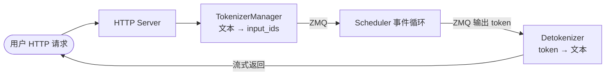
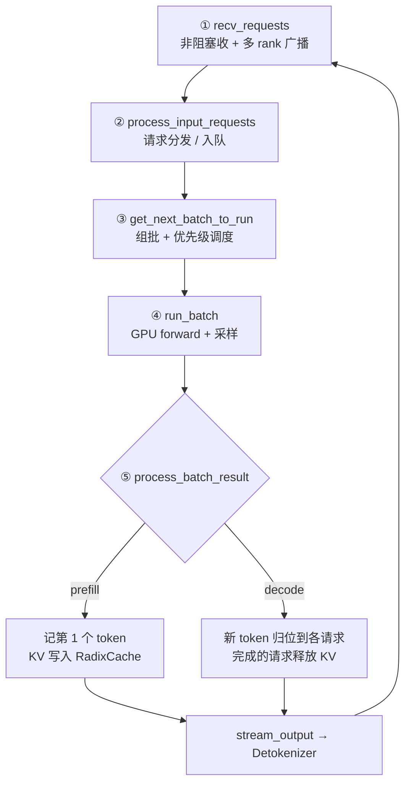
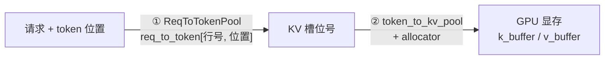
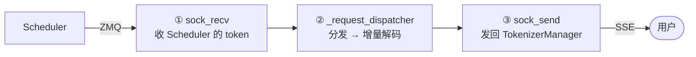

# SGLang 架构与调度循环源码走读

> 一句话：SGLang 推理引擎用**三进程分工**（Tokenizer / Scheduler / Detokenizer）+ **三层设计**（服务层 / 调度层 / 模型层）把 CPU 与 GPU 的活儿拆开；真正的引擎心跳是 Scheduler 进程里那个 `while True` 事件循环——**收请求 → 分发 → 组批 → 跑模型 → 处理结果**，循环不息。

## 一、分层架构

| 层 | 职责 | 关键组件 |
|---|---|---|
| **服务层** | 对外 HTTP / OpenAI 兼容 API，收请求、tokenize、返回响应 | HTTP Server + TokenizerManager |
| **调度层** | 引擎大脑：请求排队、连续组批（continuous batching）、KV 缓存管理、驱动前向 | Scheduler |
| **模型层** | 在 GPU 上实际跑前向（prefill / decode） | ModelWorker → ModelRunner |

架构图（引自 Awesome-ML-SYS-Tutorial 的 SGLang code-walk-through）：

## 二、三进程模型

SGLang 把流水线拆成**三个进程**，用 **ZMQ** 消息通道通信。这样 CPU 侧（tokenize / detokenize）和 GPU 侧（模型前向）能并行，不被 Python GIL 互相拖累：

| 进程 | 职责 |
|---|---|
| **主进程** | HTTP 服务 + **TokenizerManager**：把文本 tokenize 成 `input_ids` |
| **Scheduler 子进程** | **调度大脑**：组批、管 KV 缓存、驱动模型前向 |
| **Detokenizer 子进程** | 把输出 token 解码回文本，**流式**回传（增量解码细节见 §八） |

## 三、Scheduler 事件循环（核心）

进程入口 `run_scheduler_process` 启动 Scheduler 后调用 `run_event_loop`，有两种模式：

- **`event_loop_normal`**：串行——收 → 分发 → 组批 → 跑 → 处理结果，一步接一步，简单易读。
- **`event_loop_overlap`**：重叠——上一批还在 GPU 上跑时，CPU 已经在准备下一批，把调度开销藏进计算里，吞吐更高（生产常用）。

下面以 `event_loop_normal` 为例，主循环 `while True` 的五步：

### ① `recv_requests` —— 收
从两个 ZMQ 通道（用户请求 + RPC 控制）**非阻塞**地一次性拉走当前所有能读到的消息；多 GPU（TP/DP）下把请求**广播到各 rank**，解包成请求列表返回。

### ② `process_input_requests` —— 分发
遍历上一步的请求，分门别类处理；最常见的是生成请求，交给 `handle_generate_request` 入等待队列。

### ③ `get_next_batch_to_run` —— 组批（排班总入口）
每轮循环调用一次，决定「下一步 GPU 要跑什么」。

- **输入**：运行中队列 `running_batch`（老客人池）+ 上轮成品 `last_batch`
- **输出**：这一轮要跑的 `batch_to_run` + 更新后的 `last_batch`
- **prefill 优先**：先看有没有新请求要 prefill，经 `get_new_batch_prefill` → `get_new_batch_prefill_raw` 组出 prefill 批；没有才继续跑 decode。

**等待队列的优先级调度策略**（决定谁先被 prefill）：

| 策略 | 含义 |
|---|---|
| **FCFS** | 先来先服务（默认） |
| **LPM** | 最长前缀命中优先——最大化 RadixCache 复用 |
| **DFS-Weights** | 按 radix tree 深度优先加权遍历排序 |
| **LOF** | 声明输出最长优先，按请求的 `max_new_tokens` 从大到小 |
| **Random** | 随机 |
| **Routing-Key** | 按路由键亲和性排序 |

### ④ `run_batch` —— 跑批（GPU forward + 采样）
把这一轮的 `ScheduleBatch` 交给 **ModelWorker → ModelRunner**，在 GPU 上跑一次 forward 并采样。核心三步：

1. **`resolve_forward_inputs`** —— 把上轮的 **future 引用**换成真实 tensor
2. **`forward_batch_generation`** —— 真正跑 GPU forward + 采样
   调用链：`TpModelWorker.forward_batch_generation → model_runner.forward → _forward_raw`，输出 `GenerationBatchResult`
3. **`_relay_forward_payload`** —— 把本轮结果挂进 `future_map` 供下轮取用

> **future 机制**：③④⑤ 靠 future 解耦——结果先挂成 `future_map`，下轮 `resolve_forward_inputs` 再兑现成真实 tensor。这正是 `overlap` 模式能让 CPU 调度不干等 GPU 的关键。

**采样**：LLM 一次 forward 输出的**不是 token，而是一个概率分布**；采样就是从分布里挑一个 token 当下一个词：

| 采样算法 | 做法 |
|---|---|
| **Greedy** | 直接取概率最大的 token |
| **Temperature** | 用温度把概率分布平滑 / 锐化后再采 |
| **Top-K** | 只在概率前 K 大的 token 里采样 |
| **Top-P（核采样）** | 只在累计概率达到 P 的最小 token 集里采样 |
| **Beam Search** | 同时保留多条候选路径 |

**约束采样（grammar）**：采样前把「不符合语法的 token」概率强行压成 0，保证输出合法。典型类型：正则、JSON schema、EBNF 语法、choice（枚举选项）。

**执行模式**：

| 模式 | 特点 |
|---|---|
| **eager** | 每行 Python 立即在 GPU 上执行一个 kernel，灵活但有 Python 开销 |
| **CUDA Graph** | 先把整个流程捕获成一张图，之后重放整张图、跳过 Python，延迟更低 |

**overlap 的实现**：`event_loop_overlap` 下用三个 CUDA stream（`schedule` / `forward` / `copy`）让三阶段流水并行。

### ⑤ `process_batch_result` —— 处理结果
分两条路收尾：

- **prefill**（`process_batch_result_prefill`）：记下每个请求的**第 1 个输出 token**，把算好的 KV **写进 RadixCache**。
- **decode**（`process_batch_result_decode`）：把新 token **归位**到对应请求；已完成（EOS / 达长度）的请求**释放 KV**。
- 两条路最后都调用 **`output_streamer.stream_output`**，把结果经 ZMQ 发给 **Detokenizer 进程**。

**记忆口诀：收（recv）→ 分（process input）→ 组（get batch）→ 跑（run）→ 收尾（process result）。**

## 四、关键数据结构：RadixCache 与 KV 内存池

SGLang 的招牌是 **RadixAttention**——用**基数树（radix tree）**组织 KV 缓存，自动复用请求间的**公共前缀**（相同 system prompt、few-shot 示例等）。prefill 后把 KV 写进 RadixCache，后续请求命中相同前缀即**直接复用、跳过重复 prefill**。上面 ③ 的 **LPM / DFS-Weights** 调度策略，正是为了最大化这棵树的命中率。

> 这也是压测时「前缀缓存会虚高吞吐」的根源——见 [[LLM推理压测-bench serve 与 throughput 参数详解]] 的避坑章节。
>
> 以下实现细节基于 `python/sglang/srt/mem_cache/`（radix_cache.py / evict_policy.py / memory_pool.py / allocator/paged.py），版本见文末备注。

### 4.1 树的增删改查

| 操作 | 入口方法 | 说明 |
|---|---|---|
| **增** | `insert` → `_insert_helper` | 把一段 token 序列及其 KV 索引挂进树 |
| | `cache_unfinished_req` | 便捷入口：请求 prefill 完 / decode 途中调用 |
| | `cache_finished_req` | 便捷入口：请求结束时调用 |
| **删** | `evict` | 按策略驱逐叶子释放显存（详见 4.2） |
| | `_delete_leaf` | 从树上摘掉一个叶子节点 |
| | `reset` | 清空整棵树 |
| **改** | `_split_node` | **节点分裂**：新序列只匹配到某节点的一部分时，把该节点拆成「公共段 + 剩余段」两级 |
| | `inc_lock_ref` / `dec_lock_ref` | 引用计数升降（详见 4.3） |
| **查** | `match_prefix` → `_match_prefix_helper` | 给一段 token 序列，返回「树里已缓存多少前缀」+ 对应的 KV 索引；沿树递归下行 |
| | `RadixKey.match` | 两段 token 求最长公共前缀（详见 4.4） |
| | `total_size` | 树里所有 token 总数 |

### 4.2 驱逐：七种策略，共用一个 `get_priority`

`evict` 的做法是：把所有**可驱逐叶子**按 `eviction_strategy.get_priority(node)` 建成**最小堆**，从堆顶依次弹出删除，直到腾够 token 数。所谓「策略」，本质上就是**返回一个排序键的函数**——值小的先被删。全部实现在 `evict_policy.py`，共 7 种：

| 策略 | `get_priority()` 返回 | 效果 |
|---|---|---|
| **`lru`（默认）** | `last_access_time` | 最久没被访问的先删 |
| `lfu` | `(hit_count, last_access_time)` | 命中次数最少的先删，同命中数再比时间 |
| `fifo` | `creation_time` | 最早建的先删 |
| `mru` | `-last_access_time` | 最近刚用过的先删（LRU 取反） |
| `filo` | `-creation_time` | 最晚建的先删（FIFO 取反） |
| `priority` | `(node.priority, last_access_time)` | **请求优先级**低的先删，同优先级内按 LRU |
| `slru` | `(hit_count >= 2, last_access_time)` | 分段 LRU：命中 ≥2 次进「保护段」，「试用段」整体先于保护段被删 |

命令行开关 `--radix-eviction-policy`，默认 `lru`。

两个容易漏掉的实现细节：

1. **驱逐会顺着分支向上级联**：删掉一个叶子后，若其父节点因此变成「无子节点且 `lock_ref == 0`」，父节点会**立刻被压回堆里**成为新的候选。所以驱逐是顺着一条分支往上啃，而不是只削掉最外层叶子。
2. **只有叶子进候选集**：候选来自 `evictable_leaves`，被锁住的节点不在其中——这正是下一节的作用。

### 4.3 `lock_ref`：防止正在用的前缀被删掉

`inc_lock_ref(node)` 从该节点一路走到 root，沿途每个节点 `lock_ref += 1`；`dec_lock_ref` 反之。但真正的关键不在计数本身，而在于它同时在**两个显存账本之间搬账**：

- `lock_ref` 由 `0 → 1` 时：这段 key 的长度从 `evictable_size_` **转入** `protected_size_`
- 由 `1 → 0` 时：再转回来

因为 `evict` 只在可驱逐集合里挑，所以 **`lock_ref > 0` 的前缀不可能被驱逐**。这就是为什么请求开始使用某前缀时必须 `inc`、结束时必须 `dec`——**漏掉 `dec` 会让这条分支永久占着显存不放**，表现为可用 KV 缓存越跑越少。

### 4.4 前缀匹配：指数搜索 + 二分

`RadixKey.match` 求两段 token 的最长公共前缀，**没有用逐 token 的 Python 循环**，而是两段式：

1. **指数搜索（galloping）**：按 1、2、4、8… 倍增窗口做整段切片比较，每次是一趟 C 层比较；
2. 命中第一个「不相等」的窗口后，**在该窗口内二分**定位精确的分歧点。

比较次数降到 O(log n) 量级。这么设计的动机很实际：**前缀缓存的典型场景恰恰就是超长公共前缀**（相同 system prompt、few-shot 示例），逐 token 比对会把 Python 解释器开销放大到不可接受。

> 返回的匹配长度还会按 `page_size` **向下取整**——匹配点必须落在页边界上，否则没法整页复用 KV。

### 4.5 Token-to-page：两级映射

从「第几个请求的第几个 token」定位到「GPU 显存里的哪一块」，SGLang 走的是**两级间接**：

#### 第一级：`ReqToTokenPool` —— 请求 → 槽位号

核心是一张二维大表 `req_to_token`，形状 `[size + 1, max_context_len]`，`dtype=torch.int32`：

| 方法 | 作用 |
|---|---|
| `__init__` | 建表（`torch.zeros`），并把空闲行 `free_slots` 初始化为 `1 .. size` |
| `alloc(reqs)` | 给一批请求分配**行号**（`req_pool_idx`）；已有行号的请求（如 chunked prefill 跨块续跑）直接复用原行 |
| `write(indices, values)` | 往表里填值——即把 KV 槽位号写进 `[行号, token 位置]` |

> **为什么第一维是 `size + 1` 而不是 `size`**：第 0 行是**专门空出来的 padding 行**。CUDA Graph 捕获的批次是定长的，凑数用的假请求其 `req_pool_indices` 默认为 0，让它们的读写统一落在第 0 行，就不会踩到真实请求的数据。`free_slots` 从 **1** 开始正是为此。
>
> 表用 `int32` 而非 int64，收益见 [[LLM推理的GPU硬件基础]] 中索引位宽一节。

#### 第二级：`token_to_kv_pool` + allocator —— 槽位号 → 显存

**分配**由 `PagedTokenToKVPoolAllocator`（`mem_cache/allocator/paged.py`）负责，按**页**管理，三个入口对应三种场景：

| 方法 | 场景 |
|---|---|
| `alloc(need_size)` | 通用批量分配，要求页对齐，返回连续页展开后的槽位号 |
| `alloc_extend(...)` | **prefill / extend**：只为新增部分分配页；命中前缀的那**半页会被接着写满**，靠 `last_loc` 保证页内对齐 |
| `alloc_decode(...)` | **decode**：每步只追加 1 个 token |

其中 `alloc_extend` 内部调的是 Triton kernel `alloc_extend_kernel`——要为整批请求并行算出各自的槽位分布，纯 Python 循环撑不住。

**写入**由 `MHATokenToKVPool.set_kv_buffer(layer, loc, cache_k, cache_v)` 完成，把算好的 K/V 按槽位号写进显存，内部的 `_store_kv_layer` 就是那个「按槽位号写进 `k_buffer` / `v_buffer`」的核心操作。

> `set_kv_buffer` 是基类 `KVCache` 定义的统一接口，MLA、FP8、FP4、page-major、混合线性等各种池子都各自实现一版——**换 KV 布局只需换池子，注意力 backend 与调度层不用动**。

## 五、注意力 Backend 选型

`run_batch` 里 GPU forward 用哪套注意力 kernel，由 `--attention-backend` 决定。`AttentionBackend` 是基类，所有 backend 都实现同一套接口：

| Backend | 适用场景 | 特点 |
|---|---|---|
| **flashinfer** | NVIDIA GPU（默认首选） | 专为推理优化，PagedKV 原生支持，最快 |
| **triton** | NVIDIA / AMD GPU | Triton DSL 写的通用 kernel，无 CUDA 依赖 |
| **torch_native** | CPU / 兼容性场景 | 纯 PyTorch，最慢但最通用 |
| **flashmla** | Hopper（H100/H200） | 针对 MLA（DeepSeek）优化 |
| **fa3** | H100 | FlashAttention v3 |
| **cutlass_mla** | 特定场景 | MLA 的 CUTLASS 实现 |
| **aiter** | AMD ROCm | AMD 专用 |
| **ascend** | Ascend NPU | 华为昇腾芯片 |
元数据是"说明数据怎么读"的描述信息——每条序列多长、它的 KV 散落在池子的哪些位置、每条请求的 query 从第几行开始。
Triton Backend：
	KV_indices:所有请求的kv槽位号拉成一个长条，数组
	 KV_indptr:段落分界点
	 qo_indptr:extend时，每个请求带N个新token的Q，记录不同token的Q分界点
	 构造函数：
		 1.拿到（req_to_token_pool索引表，token_to_kv_pool真显存，allocator分配器）
		 2.注册kernel函数
		 3.预分配indptrbuffer
		 4.参数配置（sliding window、MLA、DCP、投机解码）
	init_forward_metedata（decode或idle、target verify、extend/prefill）
	forward_extend
		1.准备输出buffer
		2.存KV cache
		3.选择kv_indptr
		4.调triton kernel
	 forward_decode
FlashInfer Backend：
	FlashInfer是CMU产出的推理kernel库，有wrapper+plan/run两个阶段，plan阶段会做很多的cpu侧的准备工作
	 构造函数：
		 1.预分配workspace
		 2.预分配kv_indptr/qo_indptr buffer
		 3.创建wrapper实例
		 4.创建indicesupdater，把sglang的kc cache表翻译成FlashInfer plan输入的适配层
	init_forward_metadata:plan阶段（decode、target verify、extend/prefill）
	forward_extend/forward_decode:run阶段
	关于plan_stream
TorchNativeAttnBackend:
	逐请求循环，每次gather一个请求的kv
	1.构造函数：
	2.init_forward_metadata:如果启用了SWA kv pool，把out_cache_loc从full池坐标翻译为SWA池坐标
	3.forward_extend:分配输出-》决定写去哪-》存kv cache-》决定是不是GQA-》调用_run_sdpa_forward_extend(python函数，不是kernel)
	4._run_sdpa_forward_extend：SDPA要求（H、N、D）排布-》循环体，逐请求处理-》决定要处理多少个token-》切出该请求的Q-》造一个包含空位前缀的完整的Q-》拉这个请求的k、v-》dtype对齐-》处理sliding window mask-》attention-》保留新token部分
	5._run_sdpa_forward_decode
## 六、国产 GPU/NPU 适配文件清单

> 基于本地仓库 `d:/project/sglang`（commit `fdebc938f7`，release/v0.5.16 线）实扫。**树内**只有华为昇腾和摩尔线程两家；其余国产芯片走**树外插件**路径。
> 注意 `xpu` 是 **Intel** 独显（`hardware_backend/xpu/__init__.py` 明写 "XPU (Intel GPU)"），**不是**昆仑芯，别看名字想当然。

### 6.1 适配的三种落点

SGLang 把硬件适配收敛到三个层次，看任何一家的适配都可以按这个顺序找：

| 落点 | 位置 | 作用 |
|---|---|---|
| **设备探测** | `srt/utils/common.py` 的 `is_npu()` / `is_musa()` / `is_hip()` / `is_xpu()` | 全局开关，决定走哪条分支 |
| **后端实现** | `srt/hardware_backend/<device>/` | 各设备自己的 attention / MoE / 量化 / graph runner |
| **注册分发** | `srt/layers/attention/attention_registry.py` | `@register_attention_backend("ascend")` 把实现挂到 `--attention-backend` 上 |

`hardware_backend/` 目录本身就是这套设计的产物，同级并列：`gpu`（NVIDIA）、`cpu`、`mlx`（Apple）、`xpu`（Intel）、**`npu`（昇腾）**、**`musa`（摩尔线程）**。

### 6.2 华为昇腾 Ascend NPU —— 适配最深

树内唯一的**一等公民级**国产适配：覆盖 attention、MoE、量化、图捕获、投机解码、PD 分离、LoRA，并有独立 CI 与完整文档。

**核心实现 `python/sglang/srt/hardware_backend/npu/`**

| 子模块 | 文件 |
|---|---|
| **attention** | `ascend_backend.py`（主）、`ascend_dsv4_backend.py`（DeepSeek V4）、`ascend_gdn_backend.py`（GDN）、`ascend_hybrid_linear_attn_backend.py`（混合线性注意力）、`ascend_torch_native_backend.py`（兜底）、`mla_preprocess.py` |
| **graph_runner**（对标 CUDA Graph） | `npu_graph_runner.py`、`npu_cudagraph_backend.py`、`vit_npu_graph_runner.py`、`eagle_draft_npu_graph_runner.py`、`eagle_draft_extend_npu_graph_runner.py`、`multi_layer_eagle_draft_extend_npu_graph_runner.py` |
| **MoE** | `moe/` 下 `topk.py`、`init_routing.py`、`finalize_routing.py`、`matmul.py`、`activation.py`、`hidden_states_quant.py`、`fuseep.py` |
| **量化** | `quantization/` 下 `linear_method_npu.py`、`moe_methods.py`、`awq_kernels.py`、`gptq_kernels.py` |
| **显存管理** | `allocator_npu.py`、`memory_pool_npu.py`、`cmo.py` |
| **DeepSeek V4 专用** | `dsv4/` 下 `dsv4_allocator.py`、`dsv4_memory_pool.py`、`dsv4_req_to_token_pool.py`、`dsv4_common_hooks.py` |
| **模型模块** | `modules/` 下 `deepseek_v2_attention_mla_npu.py`、`qwen_vl_processor.py`、`glm46v_processor.py` |
| **其他** | `utils.py`、`batch_invariant_ops/npu_batch_invariant_ops.py` |

**散落在主干里的 NPU 分支**

| 领域 | 文件 |
|---|---|
| PD 分离 | `srt/disaggregation/ascend/`：`conn.py`、`transfer_engine.py` |
| 通信 | `srt/distributed/device_communicators/npu_communicator.py` |
| 图编译 | `srt/compilation/npu_piecewise_backend.py` |
| MoE 分发 | `srt/layers/moe/moe_runner/ascend.py`、`srt/layers/moe/token_dispatcher/ascend_tp.py` |
| 量化 | `srt/layers/quantization/npu_mxfp4.py`、`npu_mxfp4_w4a4.py` |
| LoRA | `srt/lora/backend/ascend_backend.py` |
| torch 补丁 | `srt/utils/torch_npu_patch_utils.py` |
| 多模态生成 | `multimodal_gen/runtime/platforms/npu.py`、`layers/attention/backends/ascend_fa.py`、`layers/quantization/mxfp4_npu.py`、`mxfp8_npu.py` |

**测试 / CI / 文档 / 镜像**

- 测试：`python/sglang/test/ascend/`（`e2e/` 下精度、多机、性能三套 utils；`gsm8k_ascend_mixin.py`、`test_mmlu.py`、`test_ascend_utils.py`、`test_npu_logging.py`）
- CI：`.github/workflows/` 下 `pr-test-npu.yml`、`full-test-npu.yml`、`nightly-test-npu.yml`、`nightly-test-npu-e2e-single-node.yml`、`nightly-test-npu-e2e-multi-node.yml`、`release-docker-npu.yml`、`release-docker-npu-nightly.yml`、`diffusion-ci-gt-gen-npu.yml`
- 镜像：`docker/npu.Dockerfile`
- 文档：`docs_new/docs/hardware-platforms/ascend-npus/` **共 16 篇**，含快速上手、支持的模型/特性、量化、性能测试、精度评估、profiling、算子开发与调优、Ring SP 性能、FAQ、贡献指南

> 昇腾适配深到有**自己的算子开发指南**和**多机 E2E nightly**，说明是有厂商团队常驻维护的，不是一次性 PR。

### 6.3 摩尔线程 MUSA —— 适配较浅但自带 kernel 编译链

覆盖面窄（attention + 少量算子），但特别之处是**在 `sgl-kernel` 里有独立的 C++ 编译入口**，即自带一套 kernel 构建体系。

| 层 | 文件 |
|---|---|
| **后端实现** | `srt/hardware_backend/musa/`：`attention/flashattention_backend.py`、`kernels/topk.py`、`layers/utils/cp_utils.py`、`utils/patch_torch.py` |
| **kernel 编译链** | `sgl-kernel/` 下 `setup_musa.py`、`pyproject_musa.toml`、`csrc/musa/`、`csrc/common_extension_musa.cc`、`include/musa/`、`include/sgl_kernel_musa_ops.h`、`python/sgl_kernel/musa.py` |
| **多模态生成** | `multimodal_gen/runtime/platforms/musa.py` |
| **测试** | `multimodal_gen/test/server/musa/`（1/2 卡 server 测试 + `perf_baselines_musa.json`）、`test/unit/musa/layers/`（rmsnorm、silu_and_mul）、`test/registered/musa/test_llm_server_smoke_musa.py` |
| **CI** | `.github/workflows/pr-test-musa.yml`、`nightly-test-musa.yml` |
| **CI 脚本** | `scripts/ci/musa/musa_install_dependency.sh`、`rename_wheels_musa.sh` |
| **文档** | `docs_new/docs/hardware-platforms/mthreads_gpu.mdx` |

注意 MUSA 的 attention 入口在 `attention_registry.py` 里是**用 `_is_musa` 全局开关拦截替换**（`if not _is_musa: ...` 那段），而不像 ascend 那样用 `@register_attention_backend` 注册成一个具名 backend。

### 6.4 树外插件路径（昆仑芯等）

其余国产芯片（昆仑芯、寒武纪、海光、壁仞、天数、沐曦等）在本仓库**没有任何树内代码**（实扫 `cambricon` / `biren` / `metax` / `hygon` / `iluvatar` / `tecorigin` 全部零命中）。它们通过**插件机制**在树外适配：

- 机制文档：`docs_new/docs/hardware-platforms/plugin.mdx`
- 加载器：`srt/plugins/`（`__init__.py`、`hook_registry.py`）
- 环境变量 `SGLANG_PLATFORM` 指定 entry_point 名（文档举的例子正是 `kunlun`），命中后只调该插件的 `activate()`，其余插件跳过以免拉进无关依赖
- 测试：`test/registered/unit/plugins/test_load_plugins.py`

> 这是个**很聪明的解耦**：厂商把适配代码放自己的 pip 包里，通过 entry_point 注册，主仓库不用为每家芯片背维护成本，也不用在 import 时踩到装不上的厂商 SDK。想了解某家国产卡的支持情况，先去它自己的 fork 或 pip 包里找，别在主仓库 grep。

### 6.5 一句话总结

| 厂商 | 路径 | 深度 | 独立 CI | 文档 |
|---|---|---|---|---|
| **华为昇腾** | 树内 `hardware_backend/npu/` | 深（全栈） | ✅ 5 条 workflow | 16 篇 |
| **摩尔线程** | 树内 `hardware_backend/musa/` + `sgl-kernel` | 浅（attention 为主）+ 自带 kernel 链 | ✅ 2 条 | 1 篇 |
| **昆仑芯等其余** | 树外插件 `SGLANG_PLATFORM` | 不在本仓库 | ❌ | 仅机制文档 |

## 七、两种事件循环对比

| | `event_loop_normal` | `event_loop_overlap` |
|---|---|---|
| CPU 调度 vs GPU 计算 | 串行 | 重叠（三 CUDA stream） |
| 吞吐 | 基准 | 更高 |
| 复杂度 | 简单、适合读源码入门 | 高（要处理 future 依赖） |

读源码建议：先用 `normal` 理清主干，再看 `overlap` 如何用 future + 多 stream 把流水线气泡填满。

## 八、Detokenizer 事件循环：增量解码回文本

Scheduler 每轮吐出的是 **token id**，得由 Detokenizer 子进程解码回文本再交给用户。它的主循环同样是「收 → 分发 → 发」三步，但难点全在**增量解码**——不能等一句话的 token 全到齐再解码，得**边收边吐**，还要保证 BPE 边界正确、不把半个 UTF-8 字符吐出去。

**主循环三步：**

1. **收** `recv_obj = sock_recv(self.recv_from_scheduler)`：接收 Scheduler 发来的 token 消息。
2. **分发** `output = self._request_dispatcher(recv_obj)`：一般走 `handle_batch_token_id_out` → `_decode_batch_token_id_output`，执行增量解码。
3. **发** `sock_send(self.send_to_tokenizer, output)`：把解好的文本发回 TokenizerManager，再由它经 **SSE** 推给用户。

### 增量解码：`DecodeStatus` 与偏移量

`DecodeStatus` 记录**每个请求**的解码状态，靠几个偏移量在「已确认」与「临时输出」之间划界：

| 状态字段 | 含义 |
|---|---|
| `surr_offset` | **上下文起点**——从这里开始把 token 喂给 tokenizer 当上下文，保证 BPE 边界正确 |
| `read_offset` | **读取终点**——到这里为止的 token 才算「确认可读」 |
| `decoded_text_len` | 已「确认提交」的完整文本长度 |
| `sent_offset` | 已发给用户的字节位置（半字符时可能含「临时可打印前缀」） |
| `pending` | `= sent_offset - decoded_text_len`：上轮临时输出但没提交的字节，本轮跳过避免重复 |

**本轮增量怎么算**（解两段、相减去掉重复前缀）：

- 上下文段 `decode_ids[surr_offset:read_offset]` → 解码得 `surr_texts`
- 全量段 `decode_ids[surr_offset:]` → 解码得 `read_texts`
- **增量 = `read_texts` 去掉 `surr_texts` 前缀后剩下的后缀**——直接单独解码新 token 会因缺上下文而乱码，所以用「全量 − 上下文」取差。

### 三个难点

1. **增量翻译**：如上，上下文段与全量段各解一次、相减得增量，避免逐 token 解码产生的乱码。
2. **UTF-8 边界（半个字符）**：看新解出文本的结尾——
   - 结尾**没有** `�`：干净，直接推给用户 **+ 提交状态**（推进 offset）。
   - 结尾**有** `�`：说明最后半个字符没解全，只推**前面完整可打印的部分**，**不推进 offset**；等下一轮 token 到齐重新解码，半字符自动补全。
3. **批量翻译** `_grouped_batch_decode`：一次处理一批请求的解码。请求结束时（碰到 `</s>` / `stop=["\n\n"]` / `max_new_tokens`）用 **`trim_matched_stop`** 把停止符本身从输出里裁掉，否则用户会看到「结果 + `</s>`」这种脏尾巴。

### 输出协议：为什么用 SSE

第 3 步把文本发回 TokenizerManager 后，它用 **SSE（Server-Sent Events）** 推给用户——一种架在 HTTP 之上的**单向流式**协议，天然契合 LLM 逐字吐字：

| 技术 | 方向 / 特点 | 典型场景 |
|---|---|---|
| 普通 HTTP | 客户端 → 服务端，一问一答，一次完整响应 | REST API |
| **SSE** | 服务端 → 客户端，**单向流式**推送，长连接 | **LLM 流式输出**、股票行情、通知 |
| WebSocket | **双向**长连接 | 聊天室、协作编辑 |
| HTTP chunked | 一段一段发响应体（**SSE 的底层就用它**） | — |

## See Also

- [[LLM推理的GPU硬件基础]] — 本文各种设计的**硬件动因**：为什么必须连续组批（decode 是 memory-bound）、为什么 KV cache 是头号瓶颈、为什么索引全用 int32、为什么要做 PD 分离。
- [[LLM推理压测-bench serve 与 throughput 参数详解]] — 压测 SGLang 服务的参数详解；本文的 RadixCache 前缀复用正是那里「前缀缓存作弊」的机制来源。

## 备注

- 本文基于对 SGLang 的源码走读笔记整理，聚焦主干流程；**具体函数名 / 行号可能随 SGLang 版本变化，以实际代码为准**。
- **版本基准**：§四（RadixCache 与 KV 内存池）与 §六（国产 GPU/NPU 适配清单）的实现细节均实扫自本地仓库 `d:/project/sglang`，commit `fdebc938f7`（release/v0.5.16 线）。
- 架构图引自 [Awesome-ML-SYS-Tutorial](https://github.com/zhaochenyang20/Awesome-ML-SYS-Tutorial) 的 SGLang code-walk-through。
